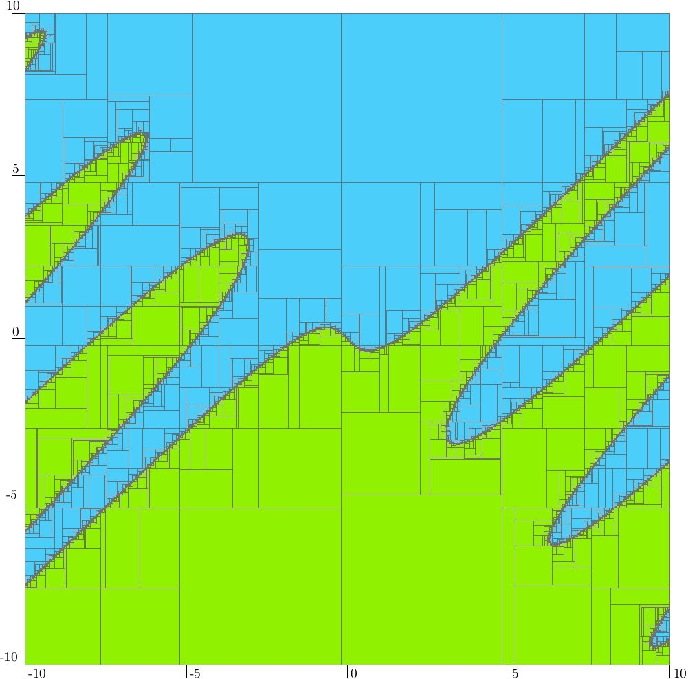

The Codac manual
================

Welcome to the Codac website.
**This manual is currently under construction.** We are actively working on it and appreciate your patience as we build a comprehensive guide.

Codac (Catalog Of Domains And Contractors) is a C++/Python/Matlab library providing tools for interval computations and constraint programming over real numbers, trajectories and sets.
It has numerous applications in parameter estimation, guaranteed integration, robot localization, and provides reliable outputs.

The toolbox allows to approximate feasible solutions of non-linear and/or differential systems. Since the solution of these complex systems cannot generally be calculated exactly, Codac uses numerical analysis to compute bounds on the sets of feasible solutions. The assets are **guarantee** (ensuring that no solutions are lost thanks to rigorous interval arithmetic) and thus **exhaustiveness** (capturing all possible values when multiple solutions exist).

Codac can therefore be used to establish numerical proofs or approximate solutions for complex systems involving variables of various types, such as real numbers, vectors, trajectories, uncertain sets, graphs, *etc.* Most of the library's developers are motivated by challenges in mobile robotics, where Codac offers new perspectives.

Recent advances in interval methods have been made by the community, and the Codac library brings together some of the corresponding state-of-the-art implementations, with the goal of making them easy to combine.

Short example: solving an equation
^^^^^^^^^^^^^^^^^^^^^^^^^^^^^^^^^^

One of Codac's applications is to solve systems of equations.
The following example [`1 <https://cyber.bibl.u-szeged.hu/index.php/actcybern/article/view/4438>`_] computes a reliable outer approximation of the solution set of the equation system:

.. math::
  :label: eq:malti

  \left( \begin{array}{c}
    -x_3^2+2 x_3 \sin(x_3 x_1)+\cos(x_3 x_2)\\
    2 x_3 \cos(x_3 x_1)-\sin(x_3 x_2)
  \end{array}\right)=\mathbf{0}.

The solution set is approximated from an initial box :math:`[\mathbf{x}_0]=[0,2]\times[2,4]\times[0,10]`. The bisection involved in the paving algorithm is configured to provide boxes with a precision :math:`\epsilon=4\times 10^{-3}`.

.. tabs::
  
  .. code-tab:: py

   from codac import *
   
   x = VectorVar(3)
   f = AnalyticFunction([x], [
     -(x[2]^2)+2*x[2]*sin(x[2]*x[0])+cos(x[2]*x[1]),
     2*x[2]*cos(x[2]*x[0])-sin(x[2]*x[1])
   ])
   
   ctc = CtcInverse(f, [0,0])
   DefaultFigure.pave([[0,2],[2,4],[0,10]], ctc, 0.004)

  .. code-tab:: c++

   #include <codac>
   using namespace codac2;

   int main()
   {
     VectorVar x(3);
     AnalyticFunction f { {x},
       {
         -(x[2]^2)+2*x[2]*sin(x[2]*x[0])+cos(x[2]*x[1]),
         2*x[2]*cos(x[2]*x[0])-sin(x[2]*x[1])
       }
     };

     CtcInverse ctc(f, {0,0});
     DefaultFigure::pave({{0,2},{2,4},{0,10}}, ctc, 0.004);
   }

  .. code-tab:: matlab

   import py.codac4matlab.*

   x = VectorVar(3);
   f = AnalyticFunction({x}, vec( ...
     -sqr(x(3))+2*x(3)*sin(x(3)*x(1))+cos(x(3)*x(2)), ...
     2*x(3)*cos(x(3)*x(1))-sin(x(3)*x(2)) ...
   ));

   ctc = CtcInverse(f, IntervalVector({0,0}));
   DefaultFigure.pave(IntervalVector({{0,2},{2,4},{0,10}}), ctc, 0.004);

The result is a set of non-overlapping boxes containing the set of feasible solutions of :eq:`eq:malti`. The following figure shows a projection of the computed set.

.. figure:: manual/example_malti.png
  :width: 400px

  Outer approximation of the solution set, computed with ``CtcInverse``. Blue parts are guaranteed to be solution-free. Computation time: 0.609s. 3624 boxes.

Short example: solving an inequality
^^^^^^^^^^^^^^^^^^^^^^^^^^^^^^^^^^^^

The previous example showed a way of solving systems of the form :math:`\mathbf{f}(\mathbf{x})=\mathbf{0}`. The library also provides tools for solving generic systems expressed as :math:`\mathbf{f}(\mathbf{x})\in[\mathbf{y}]` where :math:`[\mathbf{y}]` is an interval or a box.

The following code allows to compute the set of vectors :math:`\mathbf{x}\in\mathbb{R}^2` satisfying the inequality:

.. math::
  :label: eq:ineq

  x_1\cos(x_1-x_2)+x_2 \leqslant 0

.. tabs::
  
  .. code-tab:: py

   x = VectorVar(2)
   f = AnalyticFunction([x], x[0]*cos(x[0]-x[1])+x[1])
   sep = SepInverse(f, [-oo,0])
   DefaultFigure.pave([[-10,10],[-10,10]], sep, 0.004)

  .. code-tab:: c++

   VectorVar x(2);
   AnalyticFunction f({x}, x[0]*cos(x[0]-x[1])+x[1]);
   SepInverse sep(f, {-oo,0});
   DefaultFigure::pave({{-10,10},{-10,10}}, sep, 0.1);

  .. code-tab:: matlab

   x = VectorVar(2);
   f = AnalyticFunction({x}, x(1)*cos(x(1)-x(2))+x(2));
   sep = SepInverse(f, Interval(-oo,0));
   DefaultFigure.pave(IntervalVector({{-10,10},{-10,10}}), sep, 0.1);

  Approximation of an enclosure of the solution set computed with ``SepInverse``. The blue parts are guaranteed to have no solution, while any vector in the green boxes is a solution to the inequality. Computation time: 0.0809s.

Contributors
^^^^^^^^^^^^

This list is in alphabetical order by surname.

.. hlist::
  :columns: 4

  * Auguste Bourgois
  * `Cyril Bouvier <http://www.lirmm.fr/~bouvier/index.en.html>`_
  * `Quentin Brateau <https://teusner.github.io>`_
  * Gilles Chabert
  * `Julien Damers <http://damers.org>`_
  * Benoît Desrochers
  * `Peter Franek <http://www.cs.cas.cz/~franek>`_
  * `Maël Godard <https://godardma.github.io>`_
  * `Nuwan Herath M. <https://members.loria.fr/NHerathMudiyanselage>`_
  * `Luc Jaulin <https://www.ensta-bretagne.fr/jaulin>`_
  * `Fabrice Le Bars <https://www.ensta-bretagne.fr/lebars>`_
  * `Morgan Louédec <https://morgan-louedec.fr>`_
  * `Damien Massé <https://lab-sticc.univ-brest.fr/~dmasse>`_
  * `Bertrand Neveu <http://imagine.enpc.fr/~neveub>`_
  * Verlein Radwan
  * `Andreas Rauh <https://www.interval-methods.de>`_
  * `Simon Rohou <http://simon-rohou.fr/research>`_
  * `Joris Tillet <https://perso.ensta-paris.fr/~tillet/>`_
  * `Gilles Trombettoni <https://www.lirmm.fr/~trombetton>`_
  * `Christophe Viel <https://www.ensta-bretagne.fr/viel/>`_
  * `Raphael Voges <https://raphael-voges.de>`_

We appreciate all contributions, whether code, documentation, bug reports, or suggestions. If you believe your name should be included here and it is not, please contact us so we can update the list.

Provisional Plan
^^^^^^^^^^^^^^^^

Below is a provisional outline for the structure of this manual.
Some pages are already available.
Please note that sections may be revised or added as the content continues to evolve.

|

Overview of Codac
-----------------

* Intervals and constraints
* The Codac framework
* Target audience

User manual
-----------

* :ref:`sec-install`
   * :ref:`sec-install-py`
   * :ref:`sec-install-cpp`
   * :ref:`sec-install-matlab`

* :ref:`sec-intervals`
   * What is an interval?
   * :ref:`sec-intervals-class`
   * Boolean intervals

* :ref:`sec-linear`
   * :ref:`sec-linear-vecmat`
   * IntervalVector, IntervalMatrix
   * Matrix operations and basic linear solving
   * :ref:`sec-linear-inversion`
   * :ref:`sec-linear-lu`
   * C++: efficient matrix operations using Eigen

* :ref:`sec-functions`
   * :ref:`sec-functions-analytic`
      * :ref:`sec-functions-analytic-class`
      * :ref:`sec-functions-analytic-operators`
      * Extension to custom expressions
      * Temporal functions
   * Set-membership functions
      * The class SetMembershipFunction
      * Extension to custom expressions

* Tubes
   * What is a tube?
   * Temporal domains
   * The Tube classes
   * The Trajectory classes
   * Increasing performances using views

* Contractors
   * What are contractors?
   * How to build a contractor
   * Basic contractors
      * CtcIdentity
      * CtcEmpty
      * CtcLazy
      * CtcFixpoint
   * Linear contractors
      * CtcGaussElim
      * CtcGaussSeidel
      * CtcLinearPrecond
   * Set contractors
      * CtcUnion
      * CtcInter
      * CtcQInter
      * CtcCartProd
      * CtcProj
      * CtcNot
      * CtcAction
   * Analytic contractors
      * :ref:`sec-ctc-analytic-ctcinverse`
      * CtcInverseNotIn
   * Geometric contractors
      * :ref:`sec-ctc-geom-ctcdist`
      * :ref:`sec-ctc-geom-ctcpolar`
      * CtcSegment
      * CtcPolygon
      * CtcPointCloud
      * CtcEllipse
      * CtcCross / CtcNoCross
   * Shape contractors
      * CtcCtcBoundary
      * CtcWrapper
      * CtcImage
      * CtcDiscreteSet
   * Temporal contractors
      * Using static contractors on tubes
      * CtcDeriv
      * CtcEval
      * CtcDelay
      * CtcLinobs
      * CtcLohner
      * CtcPicard
      * CtcChain
      * CtcDiffInclusion

* Separators
   * What are separators?
   * How to build a separator
   * Basic separators
      * SepCtcPair
   * Set separators
      * SepUnion
      * SepInter
      * SepQInter
      * SepCartProd
      * SepProj
      * SepNot
      * SepAction
   * Analytic separators
      * SepInverse
      * SepTransform
   * Geometrical separators
      * SepPolarCart or SepCartPolar
      * SepPolygon
      * SepEllipse
      * SepCross
   * Shape separators
      * SepCtcBoundary
      * SepWrapper
      * SepImage
   * Contractors obtained from separators
      * CtcInnerOuter
   * Towards thick separators

* Pavers
   * The SIVIA algorithm
   * Pavers for contractors and separators
   * Paving structures
      * RegularPaving
      * NonRegularPaving

* Contractor Networks
   * What is a CN?
   * The ContractorNetwork class

* :ref:`sec-geom`
   * :ref:`sec-geom-utils`
   * :ref:`sec-geom-segment`
   * :ref:`sec-geom-polygon`
   * :ref:`sec-zonotope`
   * Polyhedron

* :ref:`sec-ellipsoids`
   * :ref:`sec-ellipsoids-intro`
   * :ref:`sec-ellipsoids-class`

* Topology
   * Extract connected subsets from pavings
   * Topological degree: verify zeros of an inclusion function

* :ref:`sec-graphics`
   * :ref:`sec-graphics-2d-figures`
   * :ref:`sec-graphics-functions`
   * :ref:`sec-graphics-colors`
   * :ref:`sec-graphics-vibes`
   * :ref:`sec-graphics-ipe`
   * :ref:`sec-graphics-3d`

* :ref:`sec-tools`
   * :ref:`sec-tools-serialization`
   * :ref:`sec-tools-registration`

* Codac extensions
   * :ref:`sec-extensions-capd`
   * Interface with the IBEX library
   * Sympy (symbolic computation)

* :ref:`sec-seealso`
   * Frequently Asked Questions
   * :ref:`sec-seealso-performances`
   * Low-level interval library

* References
   * Related papers
   * Contributors
   * How to cite Codac

How-to guides
-------------

* Robotics
   * Non-linear state estimation
   * State estimation by solving data association
   * Range-only SLAM
   * Explored area
   * Loop detections and verifications

* Geometry
   * 2d shape registration

* Dynamical systems
   * Lie symmetries for guaranteed integration
   * Solving a discrete Lyapunov equation
   * Stability analysis of a non-linear system

Development
-----------

* :ref:`sec-dev-info`
* :ref:`sec-dev-changelog`
* C++ API

.. .. toctree::
..    :hidden:
..    :caption: Overview of Codac
..    :maxdepth: 3
.. 
..    Intervals and constraints
..    The Codac framework
..    Target audience

.. toctree::
   :hidden:
   :caption: User manual
   :maxdepth: 2

   manual/installation/index.rst
   manual/intervals/index.rst
   manual/linear/index.rst
   manual/functions/index.rst
   manual/contractors/index.rst
   manual/geometry/index.rst
   manual/ellipsoids/index.rst
   manual/visualization/index.rst
   manual/tools/index.rst
   manual/extensions/index.rst
   manual/seealso/index.rst
   
..    linear/index.rst
..    functions/index.rst
..    tubes/index.rst

.. .. toctree::
..    :hidden:
..    :maxdepth: 3
.. 
..    contractors/index.rst
..    separators/index.rst

.. .. toctree::
..    :hidden:
..    :maxdepth: 2
.. 
..    pavers/index.rst
..    cn/index.rst
..    geometry/index.rst
..    topology/index.rst
..    references/index.rst

.. .. toctree::
..    :hidden:
..    :caption: How-to guides
..    :maxdepth: 3
.. 
..    howto/robotics/index.rst
..    howto/geometry/index.rst
..    howto/dynamical/index.rst

.. toctree::
   :hidden:
   :caption: Tutorial
   :maxdepth: 3

   tuto/cp_robotics/index.rst

.. toctree::
   :hidden:
   :caption: Development
   :maxdepth: 3

   development/info_dev.rst
   development/changelog.rst
.. 
..    C++ API

How to cite Codac
^^^^^^^^^^^^^^^^^

The main reference to the Codac library is `the following paper <https://www.simon-rohou.fr/research/codac/codac_paper.pdf>`_:

.. code-block:: none

  @article{codac_lib,
    title={The {C}odac Library},
    url={https://cyber.bibl.u-szeged.hu/index.php/actcybern/article/view/4388},
    DOI={10.14232/actacyb.302772},
    journal={Acta Cybernetica},
    volume={26},
    number={4},
    series = {Special Issue of {SWIM} 2022},
    author={Rohou, Simon and Desrochers, Benoit and {Le Bars}, Fabrice},
    year={2024},
    month={Mar.},
    pages={871-887}
  }
