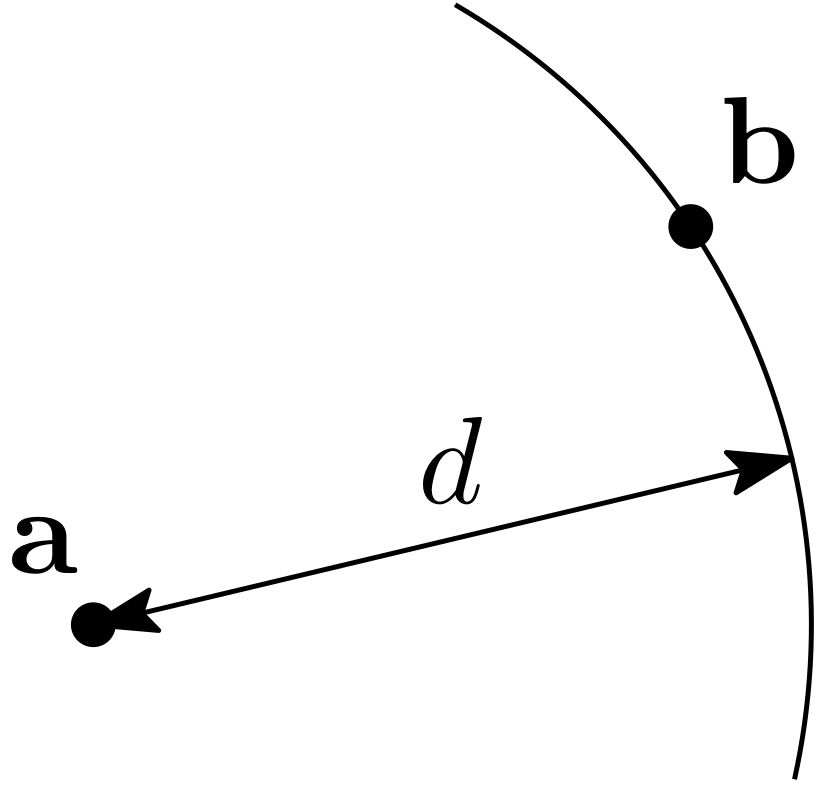
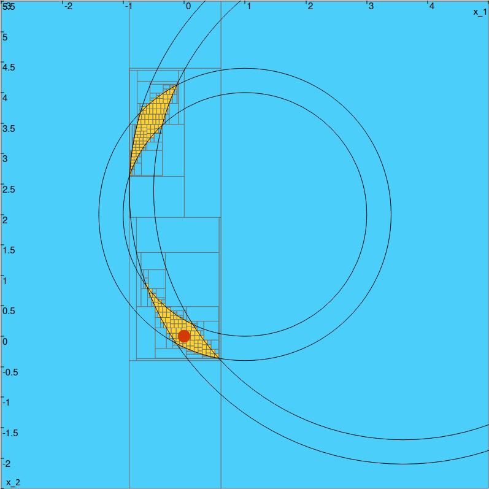

.. _sec-ctc-geom-ctcdist:

The CtcDist contractor
======================

  Main author: `Simon Rohou <https://www.simon-rohou.fr/research/>`_

.. doxygenclass:: codac2::CtcDist
  :project: codac

Methods
-------

.. doxygenfunction:: codac2::CtcDist::contract(IntervalVector&) const
  :project: codac

.. tabs::

  .. group-tab:: Python

    .. literalinclude:: src.py
      :language: py
      :start-after: [ctcdist-1-beg]
      :end-before: [ctcdist-1-end]
      :dedent: 4

  .. group-tab:: C++

    .. literalinclude:: src.cpp
      :language: c++
      :start-after: [ctcdist-1-beg]
      :end-before: [ctcdist-1-end]
      :dedent: 4

.. doxygenfunction:: codac2::CtcDist::contract(Interval&,Interval&,Interval&,Interval&,Interval&) const
  :project: codac

.. tabs::

  .. group-tab:: Python

    .. literalinclude:: src.py
      :language: py
      :start-after: [ctcdist-2-beg]
      :end-before: [ctcdist-2-end]
      :dedent: 4

  .. group-tab:: C++

    .. literalinclude:: src.cpp
      :language: c++
      :start-after: [ctcdist-2-beg]
      :end-before: [ctcdist-2-end]
      :dedent: 4

Example of use with a paver
---------------------------

A static robot located at :math:`\mathbf{x}=(0,0)^\intercal` receives range-only (distance) signals from two landmarks located at :math:`\mathbf{b}^{(1)}=(1,2)^\intercal` and :math:`\mathbf{b}^{(2)}=(3.6,2.4)^\intercal`. The observation equation :math:`y^{(i)}=g^{(i)}(\mathbf{x})` is given by:

.. math::
  
  y^{(i)}=\sqrt{(x_1-b_1^{(i)})^2+(x_2-b_2^{(i)})^2},

where :math:`\mathbf{b}^{(i)}` is the :math:`i`-th landmark emitting range-only signals.

We assume that two distances are received from the landmarks. Considering bounded uncertainties, we state the actual observations are bounded as:

- from :math:`\mathbf{b}^{(1)}`, :math:`y^{(1)}\in[2,2.4]`
- from :math:`\mathbf{b}^{(2)}`, :math:`y^{(2)}\in[4.1,4.5]`

The :math:`\mathcal{C}_{\textrm{dist}}` applies on 5d boxes but we are only interested in paving the :math:`(x_1,x_2)` space, so we will project the distance contractors associated with each landmark on :math:`(x_1,x_2)` using :math:`\mathcal{C}_{\textrm{proj}}`. The projection is restricted to the measurements and the position of the landmarks.

.. tabs::

  .. group-tab:: Python

    .. literalinclude:: src.py
      :language: py
      :start-after: [ctcdist-3-beg]
      :end-before: [ctcdist-3-end]
      :dedent: 4

  .. group-tab:: C++

    .. literalinclude:: src.cpp
      :language: c++
      :start-after: [ctcdist-3-beg]
      :end-before: [ctcdist-3-end]
      :dedent: 4

Finally, we pave the intersection of each projected contractor.

.. tabs::

  .. group-tab:: Python

    .. literalinclude:: src.py
      :language: py
      :start-after: [ctcdist-4-beg]
      :end-before: [ctcdist-4-end]
      :dedent: 6

  .. group-tab:: C++

    .. literalinclude:: src.cpp
      :language: c++
      :start-after: [ctcdist-4-beg]
      :end-before: [ctcdist-4-end]
      :dedent: 6

We obtain the following approximation:

  Outer approximation of the feasible position set.

.. admonition:: Technical documentation

  See the `C++ API documentation of this class <../../../api/html/classcodac2_1_1_ctc_dist.html>`_.