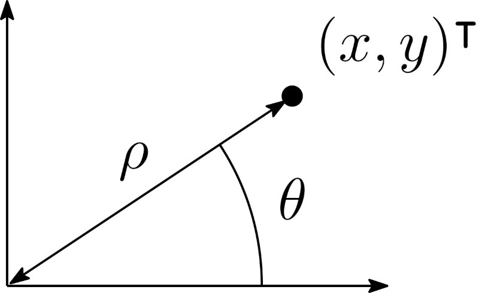

.. _sec-ctc-geom-ctcpolar:

The CtcPolar contractor
=======================

  Main authors: Benoît Desrochers, `Simon Rohou <https://www.simon-rohou.fr/research/>`_

.. doxygenclass:: codac2::CtcPolar
  :project: codac

Methods
-------

.. doxygenfunction:: codac2::CtcPolar::contract(IntervalVector&) const
  :project: codac

.. tabs::

  .. group-tab:: Python

    .. literalinclude:: src.py
      :language: py
      :start-after: [ctcpolar-1-beg]
      :end-before: [ctcpolar-1-end]
      :dedent: 4

  .. group-tab:: C++

    .. literalinclude:: src.cpp
      :language: c++
      :start-after: [ctcpolar-1-beg]
      :end-before: [ctcpolar-1-end]
      :dedent: 4

.. doxygenfunction:: codac2::CtcPolar::contract(Interval&,Interval&,Interval&,Interval&) const
  :project: codac

.. tabs::

  .. group-tab:: Python

    .. literalinclude:: src.py
      :language: py
      :start-after: [ctcpolar-2-beg]
      :end-before: [ctcpolar-2-end]
      :dedent: 4

  .. group-tab:: C++

    .. literalinclude:: src.cpp
      :language: c++
      :start-after: [ctcpolar-2-beg]
      :end-before: [ctcpolar-2-end]
      :dedent: 4

.. figure:: ./CtcPolar.png

  Illustration of several contracted boxes and pies with the ``CtcPolar`` contractor. The blue boxes :math:`[x^i]\times[y^i]` have been contracted as well as the pies :math:`[\rho^i]\times[\theta^i]`. The above script examples are displayed in this figure.

Related content
---------------

.. |polar-pdf| replace:: **Download the paper**
.. _polar-pdf: https://www.ensta-bretagne.fr/jaulin/paper_polar.pdf

.. admonition:: Related publication
  
  | **A Minimal contractor for the Polar equation: application to robot localization**
  | B. Desrochers, L. Jaulin
  | *Engineering Applications of Artificial Intelligence*, 55(Supplement C):83–92, Oct. 2016.
  | |polar-pdf|_

.. admonition:: Technical documentation

  See the `C++ API documentation of this class <../../api/html/classcodac2_1_1_ctc_polar.html>`_.