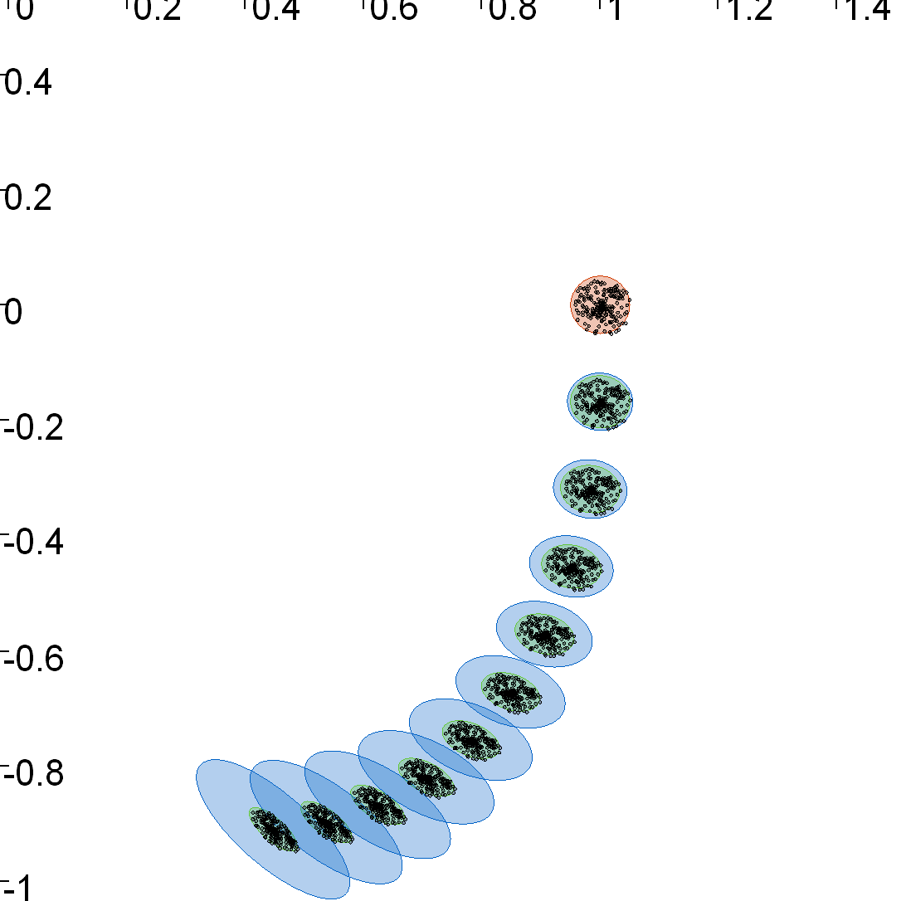
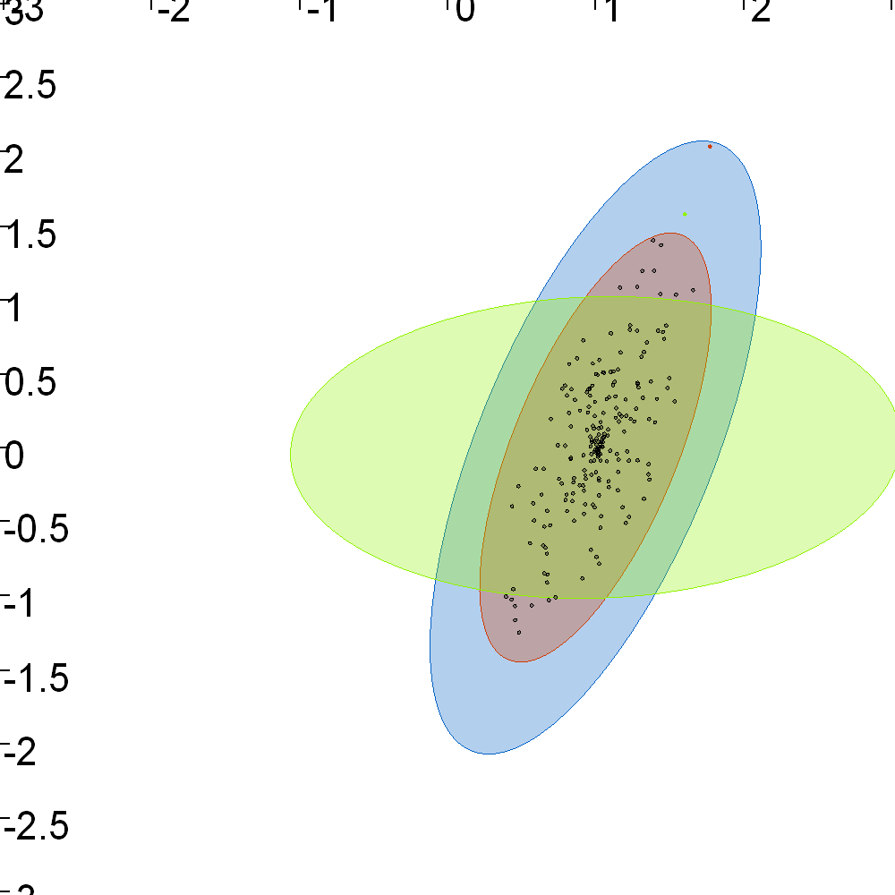
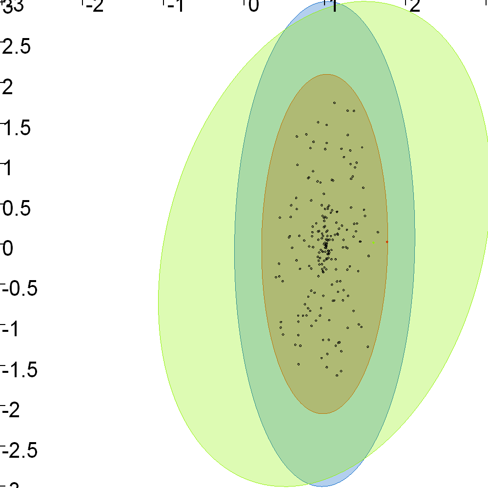
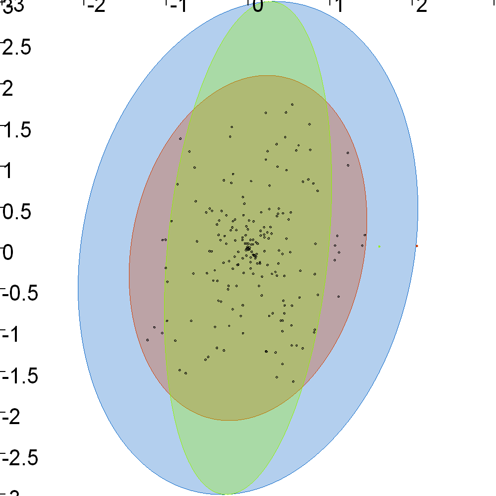
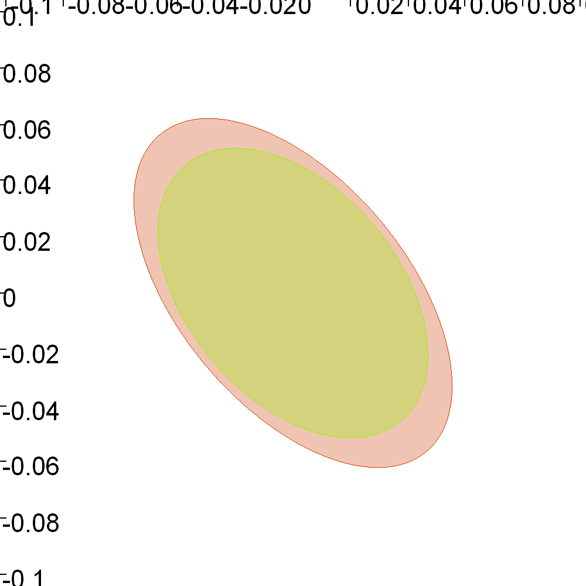

.. _sec-ellipsoids-class:

The Ellipsoid class
===================

*Main author:* `Morgan Louédec <https://morgan-louedec.fr/>`_

This page describes the Ellipsoid classes used in Codac 2 as well as some functions with ellipsoids

Class Ellipsoid
---------------

As presented in :ref:what_is_ellipsoids the n-dimensional ellipsoids is defined by a center point and a shape matrix
.. tabs::
  
    .. code-tab:: py

    # Init drawing figure
    fig1 = Figure2D('Linear and nonlinear mappings', GraphicOutput.VIBES)
    fig1.set_axes(axis(0, [0, 1.5]), axis(1, [-1., 0.5]))
    fig1.set_window_properties([0, 100], [500, 500])

    mu = Vector([1., 0.])
    G = Matrix([[0.05, 0.0],
              [0.,   0.05]])
    e1 = Ellipsoid(mu, G)

    fig1.draw_ellipsoid(e1, [Color.red(), Color.red(0.3)]) # drawing

    .. code-tab:: c++

    // Init drawing figure
    Figure2D fig1("Linear and nonlinear mappings", GraphicOutput::VIBES);
    fig1.set_axes(axis(0, {0, 1.5}), axis(1, {-1., 0.5}));
    fig1.set_window_properties({0, 100}, {500, 500});

    Vector mu({1., 0.}); // center point
    Matrix G({{0.05, 0.0},{0.,   0.05}}); // shape matrix
    Ellipsoid e1(mu,G); // ellipsoid

    fig1.draw_ellipsoid(e1, {Color::red(), Color::red(0.3)}); // draw

Linear and nonlinear mappings
-----------------------------

  Figure 1 - caption

.. tabs::

  .. code-tab:: py

    # declare nonlinear mappings
    x = VectorVar(2)
    h = AnalyticFunction ([x], vec(x[0] + 0.1 * x[1], -0.2 * sin(x[0]) + 0.9 * x[1]))

    # linear mapping
    N = 10
    e2 = Ellipsoid(e1)
    for i in range(0,N):
        A = h.diff(e2.mu).mid()
        b = Vector(h.eval(e2.mu).mid() - A * e2.mu)
        e2 = unreliable_linear_mapping(e2, A, b)
        fig1.draw_ellipsoid(e2, [Color.green(), Color.green(0.3)])

    # nonlinear mapping
    e3 = Ellipsoid(e1)
    for i in range(0,N):
        e3 = nonlinear_mapping(e3, h)
        fig1.draw_ellipsoid(e3, [Color.blue(), Color.blue(0.3)])

  .. code-tab:: c++

    // declare nonlinear mappings
    VectorVar x(2);
    AnalyticFunction h{
            {x}, vec(x[0] + 0.1 * x[1], -0.2 * sin(x[0]) + 0.9 * x[1])};

    // linear mapping by linearizing h
    int N = 10;
    Ellipsoid e2 = Ellipsoid(e1);
    for (int i = 0; i < N; i++) {
        Matrix A = h.diff(e2.mu).mid();
        Vector b(h.eval(e2.mu).mid() - A * e2.mu);
        e2 = unreliable_linear_mapping(e2, A, b);
        fig1.draw_ellipsoid(e2, {Color::green(), Color::green(0.3)});
    }

    // nonlinear mapping
    Ellipsoid e3 = Ellipsoid(e1);
    for (int i = 0; i < N; i++) {
        e3 = nonlinear_mapping(e3, h);
        fig1.draw_ellipsoid(e3, {Color::blue(), Color::blue(0.3)});
    }

Projection of the ellipsoids
----------------------------

.. tabs::

  .. code-tab:: py

      mu4 = Vector([1., 0., 0.])
      G4 = Matrix([[1.,  0.5, 0.],
                 [0.5, 2.,  0.2],
                 [0.,  0.2, 3.]])
      e4 = Ellipsoid(mu4, G4)

      G5 = 0.7 * G4
      e5 = Ellipsoid(mu4, G5)

      G6 = Matrix([[2., 0.,  0.5],
                 [0., 1.,  0.2],
                 [0., 0.2, 3.]])
      e6 = Ellipsoid(mu4, G6)

      fig2 = Figure2D('Projected ellipsoid xy', GraphicOutput.VIBES)
      fig3 = Figure2D('Projected ellipsoid yz', GraphicOutput.VIBES)
      fig4 = Figure2D('Projected ellipsoid xz', GraphicOutput.VIBES)

      fig2.set_window_properties([700, 100], [500, 500])
      fig3.set_window_properties([1200, 100], [500, 500])
      fig4.set_window_properties([0, 600], [500, 500])

      fig2.set_axes(axis(0, [-3, 3]), axis(1, [-3, 3]))
      fig3.set_axes(axis(1, [-3, 3]), axis(2, [-3, 3]))
      fig4.set_axes(axis(0, [-3, 3]), axis(2, [-3, 3]))

      fig2.draw_ellipsoid(e4, [Color.blue(), Color.blue(0.3)])
      fig3.draw_ellipsoid(e4, [Color.blue(), Color.blue(0.3)])
      fig4.draw_ellipsoid(e4, [Color.blue(), Color.blue(0.3)])

      fig2.draw_ellipsoid(e5, [Color.red(), Color.red(0.3)])
      fig3.draw_ellipsoid(e5, [Color.red(), Color.red(0.3)])
      fig4.draw_ellipsoid(e5, [Color.red(), Color.red(0.3)])

      fig2.draw_ellipsoid(e6, [Color.green(), Color.green(0.3)])
      fig3.draw_ellipsoid(e6, [Color.green(), Color.green(0.3)])
      fig4.draw_ellipsoid(e6, [Color.green(), Color.green(0.3)])

  .. code-tab:: c++

      Ellipsoid e4 {
              {1., 0., 0.}, // mu
              {{1.,  0.5, 0.}, // G
               {0.5, 2.,  0.2},
               {0.,  0.2, 3.}}
          };

      Ellipsoid e5 {
          e4.mu, // mu
          0.7 * e4.G // G
      };

      Ellipsoid e6 {
          e4.mu, // mu
          {{2., 0.,  0.5}, // G
           {0., 1.,  0.2},
           {0., 0.2, 3.}}
      };

      Figure2D fig2("Projected ellipsoid xy", GraphicOutput::VIBES);
      Figure2D fig3("Projected ellipsoid yz", GraphicOutput::VIBES);
      Figure2D fig4("Projected ellipsoid xz", GraphicOutput::VIBES);

      fig2.set_window_properties({700, 100}, {500, 500});
      fig3.set_window_properties({1200, 100}, {500, 500});
      fig4.set_window_properties({0, 600}, {500, 500});

      fig2.set_axes(axis(0, {-3, 3}), axis(1, {-3, 3}));
      fig3.set_axes(axis(1, {-3, 3}), axis(2, {-3, 3}));
      fig4.set_axes(axis(0, {-3, 3}), axis(2, {-3, 3}));

      fig2.draw_ellipsoid(e4, {Color::blue(), Color::blue(0.3)});
      fig3.draw_ellipsoid(e4, {Color::blue(), Color::blue(0.3)});
      fig4.draw_ellipsoid(e4, {Color::blue(), Color::blue(0.3)});

      fig2.draw_ellipsoid(e5, {Color::red(), Color::red(0.3)});
      fig3.draw_ellipsoid(e5, {Color::red(), Color::red(0.3)});
      fig4.draw_ellipsoid(e5, {Color::red(), Color::red(0.3)});

      fig2.draw_ellipsoid(e6, {Color::green(), Color::green(0.3)});
      fig3.draw_ellipsoid(e6, {Color::green(), Color::green(0.3)});
      fig4.draw_ellipsoid(e6, {Color::green(), Color::green(0.3)});

  Figure 2 - caption

  Figure 3 - caption

  Figure 4 - caption

Inclusion tests
---------------
.. tabs::

    .. code-tab:: py

        print('\nInclusion test e5 in e4: ', e5.is_concentric_subset(e4))
        print('\nclusion test e4 in e5: ', e4.is_concentric_subset(e5))
        print('\nclusion test e4 in e6: ', e6.is_concentric_subset(e4))
        print('\nclusion test e5 in e6: ', e5.is_concentric_subset(e6))

    .. code-tab:: c++

        cout << "\nInclusion test e5 in e4: " << e5.is_concentric_subset(e4) << endl;
        cout << "Inclusion test e4 in e5: " << e4.is_concentric_subset(e5) << endl;
        cout << "Inclusion test e4 in e6: " << e6.is_concentric_subset(e4) << endl;
        cout << "Inclusion test e5 in e6: " << e5.is_concentric_subset(e6) << endl;

Degenerated Ellipsoids & singular mappings
------------------------------------------

  Figure 5 - caption

.. tabs::

    .. code-tab:: py

        fig5 = Figure2D('singular mappings and degenerated ellipsoids', GraphicOutput.VIBES)
        fig5.set_axes(axis(0, [-0.5, 2]), axis(1, [-1.5, 1.]))
        fig5.set_window_properties([700, 600], [500, 500])

        e9 = Ellipsoid(Vector([0., 0.5]), Matrix([[0.25, 0.],
                                                [0.,   0.]]))
        e10 = Ellipsoid(Vector([0., -0.5]), Matrix([[0.25, 0.],
                                                  [0.,   0.25]]))

        fig5.draw_ellipsoid(e9, [Color.blue(), Color.red(0.3)])
        fig5.draw_ellipsoid(e10, [Color.red(), Color.red(0.3)])

        h2 = AnalyticFunction([x], vec(x[0] + 0.5 * x[1] + 0.75, -0.5 * sin(x[0]) + 0.9 * x[1] + 0.1*0.5))
        h3 = AnalyticFunction([x], vec(x[0] + 0.5 * x[1] + 1.25, x[0] + 0.5 * x[1]-0.25))

        e11 = nonlinear_mapping(e9, h2)
        e12 = nonlinear_mapping(e10, h3)

        fig5.draw_ellipsoid(e11, [Color.green(), Color.green(0.3)])
        fig5.draw_ellipsoid(e12, [Color.green(), Color.green(0.3)])

        print('\nDegenerate ellipsoid e9 (blue):\n', e9)
        print('\nImage of degenerated ellipsoid e11 (green):\n', e11)
        print('\nNon-degenerate ellipsoid e10 (red):\n', e10)
        print('\nImage of singular mapping e12 (green):\n', e12)

    .. code-tab:: c++

        Figure2D fig5("singular mappings and degenerated ellipsoids", GraphicOutput::VIBES);
        fig5.set_axes(axis(0, {-0.5, 2}), axis(1, {-1.5, 1.}));
        fig5.set_window_properties({700, 600}, {500, 500});

        Ellipsoid e9 {
            {0., 0.5}, // mu
            {{0.25, 0.}, // G
             {0.,   0.}}
        };
        Ellipsoid e10 {
            {0., -0.5}, // mu
            {{0.25, 0.}, // G
             {0.,   0.25}}
        };

        fig5.draw_ellipsoid(e9, {Color::blue(), Color::red(0.3)});
        fig5.draw_ellipsoid(e10, {Color::red(), Color::red(0.3)});

        AnalyticFunction h2{
                {x}, vec(x[0] + 0.5 * x[1] + 0.75, -0.5 * sin(x[0]) + 0.9 * x[1] + 0.1*0.5)};
        AnalyticFunction h3{
                {x}, vec(x[0] + 0.5 * x[1] + 1.25, x[0] + 0.5 * x[1]-0.25)};

        Ellipsoid e11 = nonlinear_mapping(e9, h2);
        Ellipsoid e12 = nonlinear_mapping(e10, h3);

        fig5.draw_ellipsoid(e11, {Color::green(), Color::green(0.3)});
        fig5.draw_ellipsoid(e12, {Color::green(), Color::green(0.3)});

        cout << "\nDegenerate ellipsoid e9 (blue):\n" << e9 << endl;
        cout << "\nImage of degenerated ellipsoid e11 (green):\n" << e11 << endl;
        cout << "\nNon-degenerate ellipsoid e10 (red):\n" << e10 << endl;
        cout << "\nImage of singular mapping e12 (green):\n" << e12 << endl;

Stability analysis
------------------

  Figure 6 - caption

.. tabs::

    .. code-tab:: py

        # TODO in the code

    .. code-tab:: c++

        // pendulum example
        AnalyticFunction h4{
                {x}, vec(x[0] + 0.5 * x[1] , x[1] + 0.5 * (-x[1]-sin(x[0])))};
        Ellipsoid e13 {
            Vector::zero(2), // mu
            Matrix::zero(2,2) // G
        };
        Ellipsoid e13_out {
            Vector::zero(2), // mu
            Matrix::zero(2,2) // G
        };
        int alpha_max = 1;

        if(stability_analysis(h4,alpha_max, e13, e13_out) == BoolInterval::TRUE)
        {
            cout << "\nStability analysis: the system is stable" << endl;
            cout << "Ellipsoidal domain of attraction e13 (red):" << endl;
            cout << e13 << endl;
            cout << "Outter enclosure e13_out of the Image of e13 by h4 (green):" << endl;
            cout << e13_out << endl;
        }
        else
        {
            cout << "\nStability analysis: the method is not able to conclude" << endl;
        }
        Figure2D fig6("Stability analysis - pendulum example", GraphicOutput::VIBES);
        fig6.set_axes(axis(0, {-0.1, 0.1}), axis(1, {-0.1, 0.1}));
        fig6.set_window_properties({1200, 600}, {500, 500});
        fig6.draw_ellipsoid(e13, {Color::red(), Color::red(0.3)});
        fig6.draw_ellipsoid(e13_out, {Color::green(), Color::green(0.3)});

