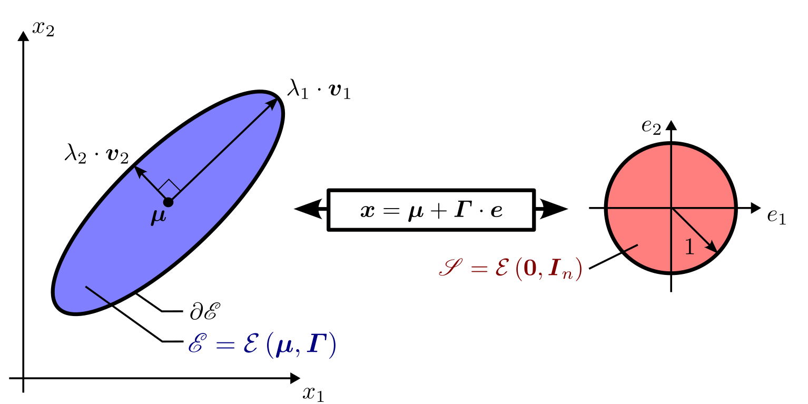
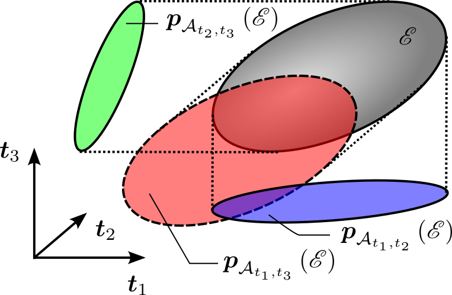

.. _sec-ellipsoids-intro:

Ellipsoid in n-dimensional space (matrix definition)
====================================================

  Main author: `Morgan Louédec <https://morgan-louedec.fr>`_

Link to the :ref:`Codac_ellipsoid_implementation<sec-ellipsoids-class>`

Definition of an Ellipsoid
---------------------------------

  Figure 1 - Representation of a 2-dimensional ellipsoid $\mathscr{E}$. The semi-axis of the ellipsoid are described by the eigenvalues
  and the eigenvectors of $\boldsymbol{\Gamma}$.

An **ellipsoid** in \(n\)-dimensional space can be described by a unique midpoint
$\boldsymbol{\mu}\in\mathbb{R}^n$, a unique shape matrix $\boldsymbol{\Gamma}\in S_n^+$ (real symmetric positive definite), and the quadratic form:

.. math::

  \mathcal{E}\left(\boldsymbol{\mu},\boldsymbol{\Gamma}\right) :=  \{\boldsymbol{x}\in\mathbb{R}^n | \left(\boldsymbol{x}-\boldsymbol{\mu}\right)^T \Gamma^{-2} \left(\boldsymbol{x}-\boldsymbol{\mu}\right) \leq 1\}.

When $\boldsymbol{\mu}=\boldsymbol{0}$, the ellipsoid is said to be centred.
The unitary eigenvectors $\left\{\boldsymbol{v}_{1}, \boldsymbol{v}_{2},\cdots,\boldsymbol{v}_{n}\right\} $
of $\boldsymbol{\varGamma}$ gives the direction of the semi-axis.
The length of the semi-axis is given by the eigenvalues $\left\{\lambda_{1}, \lambda_{2}, \cdots ,\lambda_{n}\right\} $
of $\boldsymbol{\varGamma}$. The $i^{\text{th}}$ semi-axis of $\mathcal{E}\left(\boldsymbol{\mu},\boldsymbol{\varGamma}\right)$
is written $\lambda_{i}\cdot\boldsymbol{v}_{i}$. The size of the ellipsoids can be evaluated as

.. math::

    \begin{align}
    \mathrm{size}\left(\mathcal{E}\left(\boldsymbol{\mu},\boldsymbol{\varGamma}\right)\right) =
    \det\left(\boldsymbol{\varGamma}\right) = \prod \limits_{i=1}^{n} \lambda_{i}.
    \end{align}

The surface of a two dimensional ellipsoid $\mathscr{E}_2$ is given by $S =  \pi\cdot \textrm{size}\left(\mathscr{E}_2\right)$.
The volume of a three dimensional ellipsoid $\mathscr{E}_2$ is given by $V = \frac{4\pi}{3}\cdot \textrm{size}\left(\mathscr{E}\right)$.

An ellipsoid can also be described by an affine transformation of the unit sphere:

.. math::

  \mathcal{E}\left(\boldsymbol{\mu},\boldsymbol{\Gamma}\right) =  \boldsymbol{\mu} + \boldsymbol{\Gamma} \cdot \mathcal{E}\left(\boldsymbol{0},\boldsymbol{I_n}\right).

where $\mathcal{E}\left(\boldsymbol{0},\boldsymbol{I_n}\right)$ is the unit sphere. More generally,
an affine mapping of an ellipsoid $\mathcal{E}\left(\boldsymbol{\mu}_1,\boldsymbol{\Gamma}_1\right)$ with a matrix $\boldsymbol{A}\in\mathbb{R}^{n\times n}$
and a vector $\boldsymbol{b}\in\mathbb{R}^n$ result in another ellipsoid:

.. math::

  \mathcal{E}\left(\boldsymbol{\mu}_2,\boldsymbol{\Gamma}_2\right) = \boldsymbol{A} \cdot \mathcal{E}\left(\boldsymbol{\mu}_1,\boldsymbol{\Gamma}_1\right) + \boldsymbol{b},

with $\boldsymbol{\mu}_2 = \boldsymbol{A} \cdot \boldsymbol{\mu}_1 + \boldsymbol{b}$ and $\boldsymbol{\Gamma}_2 = \left(\boldsymbol{A}\boldsymbol{\varGamma}_1^{2}\boldsymbol{A}^{T}\right)^{\frac{1}{2}}$.

Inclusion of ellipsoids
---------------------------------

For two ellipsoids $\mathscr{E}_{1}=\mathcal{E}\left(\boldsymbol{\mu}_1,\boldsymbol{\Gamma}_1\right)$ and
$\mathscr{E}_{2}=\mathcal{E}\left(\boldsymbol{\mu}_1,\boldsymbol{\Gamma}_1\right)$,
the inclusion and the strict inclusion are respectively denoted by the
symbols $\subseteq$ and $\subset$ such that

.. math::
    \begin{align}
    \left(\mathscr{E}_{1}\subset\mathscr{E}_{2}\right) & \Leftrightarrow\left(\mathscr{E}_{1}\subseteq\mathscr{E}_{2}\,\,\text{and}
    \,\,\mathscr{E}_{1}\cap\partial\mathscr{E}_{2}=\emptyset\right)\label{eq:inclusion_definition}.
    \end{align}

If two ellipsoids have the same midpoint ($\boldsymbol{\mu}_1 = \boldsymbol{\mu}_2$), their mutual inclusion can
be verified using their shape matrices:

.. math::
    \begin{align}
    \left(\mathscr{E}_{1}\subseteq\mathscr{E}_{2}\right) & \Leftrightarrow\left(\boldsymbol{\varGamma}_{1}^{-2}-\boldsymbol{\varGamma}_{2}^{-2}\succeq0\right),\\
    \left(\mathscr{E}_{1}\subset\mathscr{E}_{2}\right) & \Leftrightarrow\left(\boldsymbol{\varGamma}_{1}^{-2}-\boldsymbol{\varGamma}_{2}^{-2}\succ0\right).
    \end{align}

Orthogonal projection of ellipsoids on affine space [1,Section 13]
------------------------------------------------------------------

Consider the orthogonal matrix $\boldsymbol{T}=\left[\begin{array}{cc}
\boldsymbol{t}_{1} & \boldsymbol{t}_{2}\end{array}\right]\in\mathbb{R}^{n\times2}$ and the plane

.. math::
    \begin{align}
    \mathcal{A}_{t_{1},t_{2}} & :=\left\{ \boldsymbol{x}\in\mathbb{R}^{n}|\exists\boldsymbol{t}\in\mathbb{R}^{2},\boldsymbol{x}=\boldsymbol{T}\cdot\boldsymbol{t}\right\}.
    \end{align}

The projection of an ellipsoid $\mathscr{E}$ of $\mathbb{R}^{n}$ onto the affine
space $\mathcal{A}_{i,j}$ results in the ellipsoid

.. math::
    \begin{align}
    \boldsymbol{p}_{\mathcal{A}_{t_{1},t_{2}}}\left(\mathscr{E}\right) & =\left(\boldsymbol{T}\boldsymbol{T}^{T}\right)\cdot\mathscr{E},\nonumber \\
     & =\mathcal{\mathcal{E}}\left(\boldsymbol{T}\boldsymbol{T}^{T}\boldsymbol{\mu},\left(\boldsymbol{T}\boldsymbol{T}^T\boldsymbol{\varGamma}^{2}\boldsymbol{T}\boldsymbol{T}^{T}\right)^{\frac{1}{2}}\right)
    \end{align}

with $\left(\boldsymbol{\mu},\boldsymbol{\varGamma}\right)=\mathcal{E}^{-1}\left(\mathscr{E}\right)$
and such that $\boldsymbol{p}_{\mathcal{A}_{t_{1},t_{2}}}\left(\mathscr{E}\right)\subset\mathcal{A}$.
Then, with a change of variable $\boldsymbol{y}=\boldsymbol{T}^{T}\cdot\boldsymbol{x}$,
one can display the projected ellipsoid $\boldsymbol{p}_{\mathcal{A}_{t_{1},t_{2}}}\left(\mathscr{E}\right)$
in the frame $\left(\boldsymbol{0},\boldsymbol{t}_{1},\boldsymbol{t}_{2}\right)$,
as illustrated by Figure 2.

  Figure 2 - A $3$-dimensional ellipsoid can
  be displayed with three $2$-dimensional orthogonal projections with
  three orthogonal vectors $\boldsymbol{t}_{1}$, $\boldsymbol{t}_{2}$
  and $\boldsymbol{t}_{3}$.

References
----------

- [1] Stephen B Pope. Algorithms for Ellipsoids. page 49, 2008