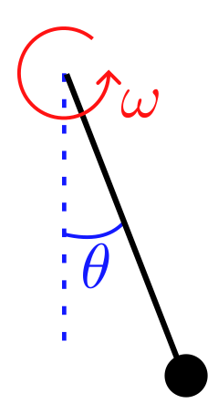
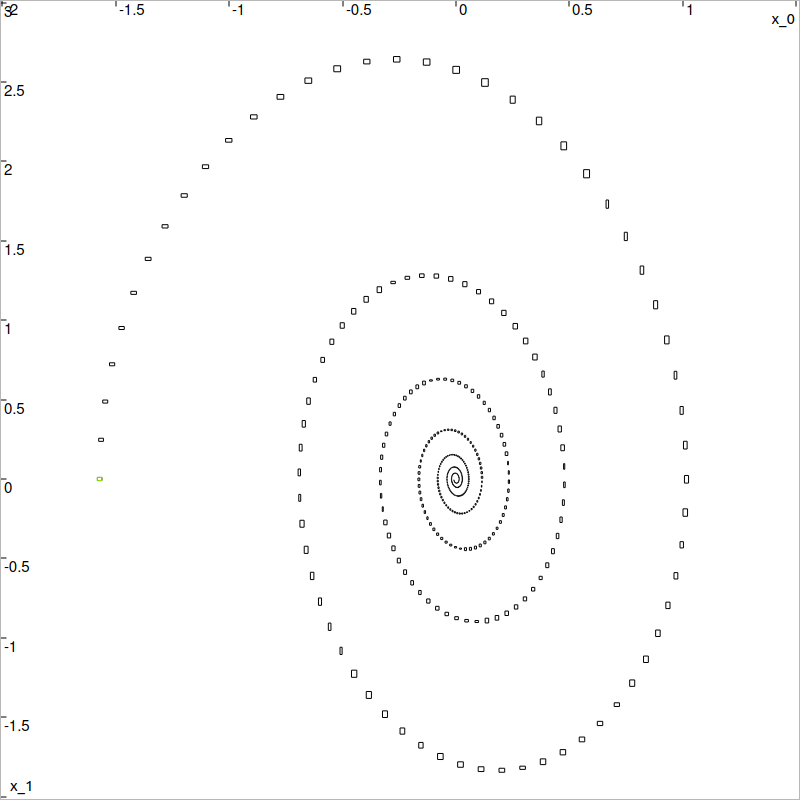

.. _sec-extensions-capd:

CAPD (rigorous numerics in dynamical systems)
=============================================

  Main author: `Maël Godard <https://godardma.github.io>`_

This page describes how to use the CAPD library with Codac. CAPD is a C++ library for rigorous numerics in dynamical systems.

To use CAPD with Codac, you first need to install the CAPD library. You can find the installation instructions on the `CAPD website <http://capd.ii.uj.edu.pl/html/capd_compilation.html>`_.

Note that as CAPD is a C++ only library, the content present in this page is **only available in C++**.

Installing the ``codac-capd`` extension
---------------------------------------

To install the ``codac-capd`` extension, you need to install the Codac library from its sources. This can be done :ref:`by using CMake <sec-install-cpp>` with the option ``WITH_CAPD=ON``. For example:

.. code-block:: bash

      cmake -DCMAKE_INSTALL_PREFIX=$HOME/ibex-lib/build_install -DCMAKE_BUILD_TYPE=Release -DWITH_CAPD=ON ..

We highly recommend to test the installation of the library with the provided tests. To do so, you can use the following command:

.. code-block:: bash

      make test

Content
-------

The ``codac-capd`` extension provides functions to convert CAPD objects to Codac objects and vice versa.

The functions are ``to_capd`` and ``to_codac``. They can be used to convert the following objects:

- ``capd::Interval`` :math:`\leftrightarrow` ``codac2::Interval``
- ``capd::IVector`` :math:`\leftrightarrow` ``codac2::IntervalVector``
- ``capd::IMatrix`` :math:`\leftrightarrow` ``codac2::IntervalMatrix``
- ``capd::ITimeMap::SolutionCurve`` :math:`\rightarrow` ``codac2::SlicedTube<codac2::IntervalVector>``

How to use
----------

The header of the ``codac-capd`` extension is not included by default. You need to include it manually in your code, together with the CAPD library:

.. code-block:: c++
  
  #include <codac-capd.h>
  #include <capd/capdlib.h>

You can use the functions ``to_capd`` and ``to_codac`` to convert between CAPD and Codac objects as follows:

.. tabs::

  .. code-tab:: c++

    codac2::Interval codac_interval(0,2);  // Codac interval [0, 2]
    capd::Interval capd_interval = to_capd(codac_interval); // convert to CAPD interval
    codac2::Interval codac_interval2 = to_codac(capd_interval); // convert back to Codac interval

Example
-------

For this example we will consider the pendulum with friction.

The state variables of the pendulum are its angle :math:`\theta` and its angular velocity :math:`\omega`. The pendulum follows the following dynamic:

.. math::
  
  \left(\begin{array}{c}
  \dot{\theta}\\
  \dot{\omega}
  \end{array}\right)=\left(\begin{array}{c}
  \omega\\
  -\sin(\theta)\cdot\frac{g}{l}-0.5\omega
  \end{array}\right),
  

where :math:`g` is the gravity constant and :math:`l` is the length of the pendulum.

This equation can be passed to the CAPD library as follows:

.. tabs::

  .. group-tab:: C++

    .. literalinclude:: src.cpp
      :language: c++
      :start-after: [codac-capd-2-beg]
      :end-before: [codac-capd-2-end]
      :dedent: 2

To solve this ODE, an ``IOdeSolver`` object is necessary.

.. tabs::

  .. group-tab:: C++

    .. literalinclude:: src.cpp
      :language: c++
      :start-after: [codac-capd-3-beg]
      :end-before: [codac-capd-3-end]
      :dedent: 2

CAPD then uses an ``ITimeMap`` to make the link between a time step and the solution of the ODE at this time. The ``I`` here stands for ``Interval`` as the solution is an interval guaranteed to enclose the solution. Here we will integrate the ODE between :math:`t_0=0s` and :math:`t_f=20s`.

.. tabs::

  .. group-tab:: C++

    .. literalinclude:: src.cpp
      :language: c++
      :start-after: [codac-capd-4-beg]
      :end-before: [codac-capd-4-end]
      :dedent: 2

To completly define the ODE, we need to define the initial conditions. Here we will set the initial angle to :math:`\theta_0=-\frac{\pi}{2}` and the 
initial angular velocity to :math:`\omega_0=0`. For the purpose of this example, we will add a small uncertainty to the initial conditions. The initial conditions are then defined as follows:

.. tabs::

  .. group-tab:: C++

    .. literalinclude:: src.cpp
      :language: c++
      :start-after: [codac-capd-5-beg]
      :end-before: [codac-capd-5-end]
      :dedent: 2

There are then two ways to get the result of the integration depending on the use case.

If the desired result is the solution of the ODE at a given time (here say :math:`T=1s`), we can do as follows:

.. tabs::

  .. group-tab:: C++

    .. literalinclude:: src.cpp
      :language: c++
      :start-after: [codac-capd-6-beg]
      :end-before: [codac-capd-6-end]
      :dedent: 2

**Be careful, this method modifies the initial set** ``s`` **in place**.

If the desired result is the solution curve (or tube) of the ODE on the time domain :math:`[t_0,t_f]`, we can do as follows:

.. tabs::

  .. group-tab:: C++

    .. literalinclude:: src.cpp
      :language: c++
      :start-after: [codac-capd-7-beg]
      :end-before: [codac-capd-7-end]
      :dedent: 2

The variable ``solution`` is the desired solution curve (or tube). The operator ``solution(t)`` gives the solution at time :math:`t`. 
It can be converted into a Codac ``SlicedTube<IntervalVector>`` with the function ``to_codac``. This functions takes two arguments:

- the ``capd::ITimeMap::SolutionCurve`` to convert.
- a ``codac2::TDomain`` object defining the temporal domain of the tube.

The resulting ``SlicedTube`` will have the same time domain as the one given in argument, completed with the CAPD gates. An example of conversion is : 

.. tabs::

  .. group-tab:: C++

    .. literalinclude:: src.cpp
      :language: c++
      :start-after: [codac-capd-8-beg]
      :end-before: [codac-capd-8-end]
      :dedent: 2

A full display can be done with the following code:

.. tabs::

  .. group-tab:: C++

    .. literalinclude:: src.cpp
      :language: c++
      :start-after: [codac-capd-9-beg]
      :end-before: [codac-capd-9-end]
      :dedent: 4

The result is the following figure, with in green the initial set (:math:`t=0s`) and in red the final set (:math:`t=20s`). The ``SlicedTube`` is displayed in blue with a black edge for better visibility. The orange rectangles correspond to the gates (degenerate slices).

  Result of the CAPD integration of the pendulum, enclosed in a Codac tube.