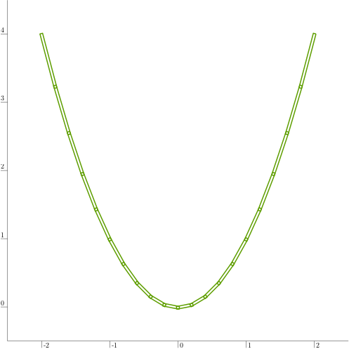
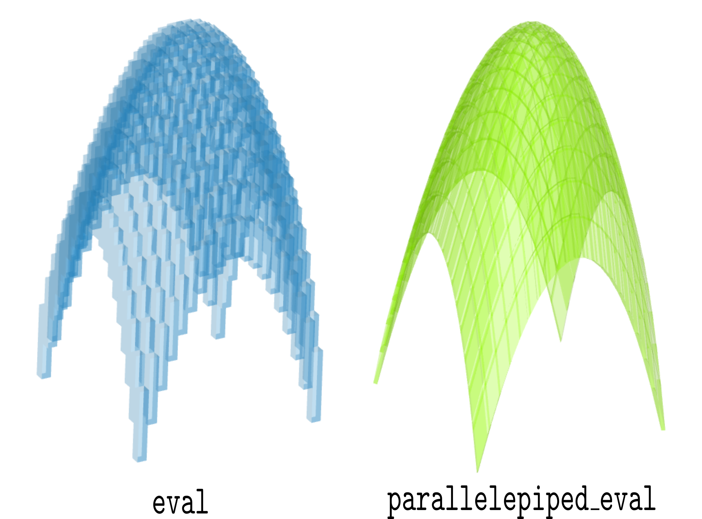
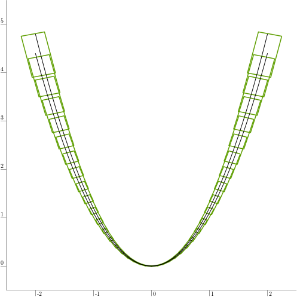

.. _sec-functions-parallelepiped-eval:

Parallelepiped inclusion function
=================================

  Main authors: `Maël Godard <https://godardma.github.io>`_

Use case
--------

Consider a function :math:`\mathbf{f}:\mathbb{R}^n\to\mathbb{R}^m`. In the case where :math:`0<n<m`,
a parallelepiped inclusion function is available in the library.

A parallelepiped inclusion function of :math:`\mathbf{f}` is noted :math:`\langle\mathbf{f}\rangle`.
For a :math:`n`-dimensional box :math:`[\mathbf{x}]`, :math:`\langle\mathbf{f}\rangle([\mathbf{x}])` is a parallelepiped which enclose :math:`\mathbf{f}([\mathbf{x}])`.

**Note that this inclusion function also works with thick functions.**

Examples
--------

:math:`\mathbb{R}^1\to\mathbb{R}^2`
~~~~~~~~~~~~~~~~~~~~~~~~~~~~~~~~~~~

Define the parabolic function :math:`\mathbf{f}:\mathbb{R}\to\mathbb{R}^2` such that

.. math:: 
  \mathbf{f}(x)=
  \left(
  \begin{array}{c}
  x\\
  x^{2}
  \end{array}
  \right)

It can be defined in Codac as follows:

.. tabs::

  .. group-tab:: Python

    .. literalinclude:: src.py
      :language: py
      :start-after: [1-beg]
      :end-before: [1-end]
      :dedent: 0

  .. group-tab:: C++

    .. literalinclude:: src.cpp
      :language: c++
      :start-after: [1-beg]
      :end-before: [1-end]
      :dedent: 4

  .. group-tab:: Matlab

    .. literalinclude:: src.m
      :language: matlab
      :start-after: [1-beg]
      :end-before: [1-end]
      :dedent: 0

The performances of the parallelepiped inclusion function can be visualized as follows:

.. tabs::

  .. group-tab:: Python

    .. literalinclude:: src.py
      :language: py
      :start-after: [2-beg]
      :end-before: [2-end]
      :dedent: 0

  .. group-tab:: C++

    .. literalinclude:: src.cpp
      :language: c++
      :start-after: [2-beg]
      :end-before: [2-end]
      :dedent: 4

  .. group-tab:: Matlab

    .. literalinclude:: src.m
      :language: matlab
      :start-after: [2-beg]
      :end-before: [2-end]
      :dedent: 0

The resulting plot is shown below. In green is the result of the evaluation using parallelepipeds.

:math:`\mathbb{R}^2\to\mathbb{R}^3`
~~~~~~~~~~~~~~~~~~~~~~~~~~~~~~~~~~~

Define the parabolic function :math:`\mathbf{f}:\mathbb{R}^2\to\mathbb{R}^3` such that

.. math:: 
  \mathbf{f}(\mathbf{x})=
  \left(
  \begin{array}{c}
  x_{1}\\
  x_{2}\\
  x_{1}^{2}+x_{2}^{2}
  \end{array}
  \right)

It can be defined in Codac as follows:

.. tabs::

  .. group-tab:: Python

    .. literalinclude:: src.py
      :language: py
      :start-after: [3-beg]
      :end-before: [3-end]
      :dedent: 0

  .. group-tab:: C++

    .. literalinclude:: src.cpp
      :language: c++
      :start-after: [3-beg]
      :end-before: [3-end]
      :dedent: 4

  .. group-tab:: Matlab

    .. literalinclude:: src.m
      :language: matlab
      :start-after: [3-beg]
      :end-before: [3-end]
      :dedent: 0

The performances of the parallelepiped inclusion function can be visualized as follows:

.. tabs::

  .. group-tab:: Python

    .. literalinclude:: src.py
      :language: py
      :start-after: [4-beg]
      :end-before: [4-end]
      :dedent: 0

  .. group-tab:: C++

    .. literalinclude:: src.cpp
      :language: c++
      :start-after: [4-beg]
      :end-before: [4-end]
      :dedent: 4

  .. group-tab:: Matlab

    .. literalinclude:: src.m
      :language: matlab
      :start-after: [4-beg]
      :end-before: [4-end]
      :dedent: 0

The resulting figure is shown below. On the left is the result of the interval evaluation of Codac (layer "box") (see :ref:`subsec-functions-analytic-class-evaluations`).
On the right is the evaluation using parallelepipeds (layer "parallelepiped").

Thick function
~~~~~~~~~~~~~~

Define the thick parabolic function :math:`\mathbf{f}:\mathbb{R}\to\mathbb{R}^2` such that

.. math:: 
  \mathbf{f}(x)=
  \left(
  \begin{array}{c}
  x\\
  \left[1.1,1.2\right]\cdot x^{2}
  \end{array}
  \right)

It is called a thick function because the output of this function is always a box (here an interval) even when the input is a real number.

It can be defined in Codac as follows:

.. tabs::

  .. group-tab:: Python

    .. literalinclude:: src.py
      :language: py
      :start-after: [5-beg]
      :end-before: [5-end]
      :dedent: 0

  .. group-tab:: C++

    .. literalinclude:: src.cpp
      :language: c++
      :start-after: [5-beg]
      :end-before: [5-end]
      :dedent: 4

  .. group-tab:: Matlab

    .. literalinclude:: src.m
      :language: matlab
      :start-after: [5-beg]
      :end-before: [5-end]
      :dedent: 0

The thickness of the function can be visualized by plotting the lower and upper trajectories:

.. tabs::

  .. group-tab:: Python

    .. literalinclude:: src.py
      :language: py
      :start-after: [6-beg]
      :end-before: [6-end]
      :dedent: 0

  .. group-tab:: C++

    .. literalinclude:: src.cpp
      :language: c++
      :start-after: [6-beg]
      :end-before: [6-end]
      :dedent: 4

  .. group-tab:: Matlab

    .. literalinclude:: src.m
      :language: matlab
      :start-after: [6-beg]
      :end-before: [6-end]
      :dedent: 0

The performances of the parallelepiped inclusion function can then be visualized as follows:

.. tabs::

  .. group-tab:: Python

    .. literalinclude:: src.py
      :language: py
      :start-after: [7-beg]
      :end-before: [7-end]
      :dedent: 0

  .. group-tab:: C++

    .. literalinclude:: src.cpp
      :language: c++
      :start-after: [7-beg]
      :end-before: [7-end]
      :dedent: 4

  .. group-tab:: Matlab

    .. literalinclude:: src.m
      :language: matlab
      :start-after: [7-beg]
      :end-before: [7-end]
      :dedent: 0

The resulting plot is shown below. In green is the result of the evaluation using parallelepipeds, and in black are the lower and upper trajectories.

Related work
------------

This method comes from `this article <https://www.sciencedirect.com/science/article/pii/S0888613X25002154?via%3Dihub>`_