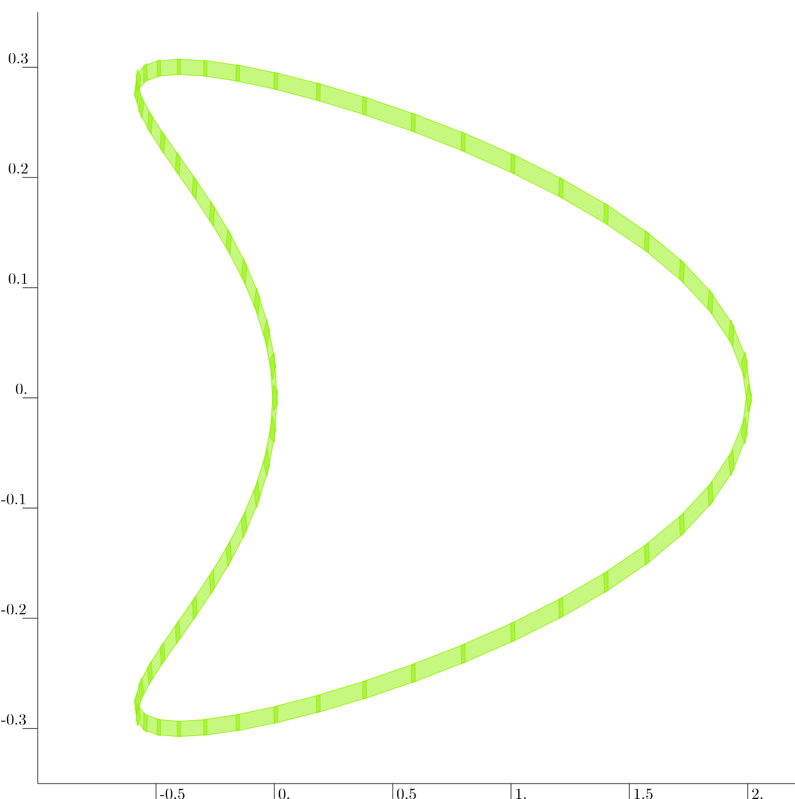

.. _sec-functions-peibos:

PEIBOS
======

The PEIBOS tool provides a way to compute the Parallelepipedic Enclosure of the Image of the BOundary of a Set.

Let us consider an initial set :math:`\mathbb{X}_0 \subset \mathbb{R}^n` with its boundary :math:`\partial \mathbb{X}_0`. 
Considering a function :math:`\mathbf{f}:\mathbb{R}^n \to \mathbb{R}^p`, :math:`n \leq p`, the PEIBOS tool allows to compute the set :math:`\mathbf{Y}=\left\{ \mathbf{f}(\mathbf{x}) \mid \mathbf{x} \in \partial \mathbb{X}_0 \right\}`.

Gnomonic atlas
--------------

To handle the boundary of the initial set :math:`\mathbb{X}_0`, the PEIBOS tool relies on a gnomonic atlas. 

A gnomonic atlas of :math:`\partial \mathbb{X}_0` is composed of the inverse chat :math:`\psi_0` and a set of symmetries :math:`\Sigma` such that:

.. math:: 
  \partial \mathbb{X}_0 = \bigcup_{\sigma \in \Sigma} \sigma \circ \psi_0(\left[-1,1\right]^{m})

where :math:`m` is the dimension of the boundary :math:`\partial \mathbb{X}_0`, :math:`m < n`.

Example
~~~~~~~

Consider the case where :math:`\mathbb{X}_0` is the unit disk. Its boundary :math:`\partial \mathbb{X}_0` is the unit circle :math:`\mathcal{S}^1`.

The image of :math:`\left[-1,1\right]` by the function

.. math:: 
  \begin{array}{ccc}
  \psi_{0} & : & \begin{array}{ccc}
  \mathbb{R} & \rightarrow & \mathbb{R}^{2}\\
  x & \mapsto & \left(
  \begin{array}{c}
  \sin\left(x\cdot\frac{\pi}{4}\right)\\
  \cos\left(x\cdot\frac{\pi}{4}\right)
  \end{array}\right)
  \end{array}
  \end{array}

gives a quarter of :math:`\mathcal{S}^1`. If we define :math:`s` the rotation of :math:`\frac{\pi}{2}`, :math:`\mathcal{S}^1` 
can be covered by the gnomonic atlas :math:`\left\{\psi_0,\left\{1,s,s^2,s^{-1}\right\}\right\}` as shown below.

.. image:: img/gnomonic_atlas.png
   :alt: Gnomonic atlas of :math:`\mathcal{S}^1`.
   :align: center
   :width: 400px

Use
---

The PEIBOS function takes at least four arguments :

- The studied analytic function.
- The inverse chart for the gnomonic atlas (an analytic function).
- The list of symmetries for the gnomonic atlas. Note that each symmetry is represented as a hyperoctahedral symmetry, see :ref:`sec-actions-octasym`.
- A resolution :math:`\epsilon`. The initial box :math:`\left[-1,1\right]^m` will initiallly be splitted in boxes with a diameter smaller than :math:`\epsilon`.
- Eventually an offset vector can be specified if the initial set is not centered around the origin.
- Eventually a flag can be set to True to get the verbose.

For each of the small box :math:`\left[\mathbf{x}\right]`, the PEIBOS algorithm uses the :ref:`sec-functions-parallelepiped-eval` to enclose :math:`\mathbf{f}\left(\sigma\left(\psi_0\left( \left[\mathbf{x}\right] \right)\right) + \text{offset}\right)`

It returns a vector of :ref:`subsec-zonotope-parallelepiped`. Their union is an outer approximation of :math:`\mathbf{f}\left(\partial \mathbb{X}_0\right)`.

The full signature of the function is :

.. doxygenfunction:: codac2::PEIBOS(const AnalyticFunction<VectorType>&, const AnalyticFunction<VectorType>&, const std::vector<OctaSym>&, double, const Vector&, bool)
  :project: codac

Examples
--------

2D : Henon map
~~~~~~~~~~~~~~

Say that we want to compute the image of the unit circle by the Henon map defined by 

.. math::
  \mathbf{f}(\mathbf{x})=\left(\begin{array}{c}
  x_{2}+1-ax_{1}^{2}\\
  bx_{1}
  \end{array}\right),a=1.4,b=0.3

The corresponding code is:

.. tabs::

  .. group-tab:: Python

    .. literalinclude:: src.py
      :language: py
      :start-after: [peibos-1-beg]
      :end-before: [peibos-1-end]
      :dedent: 4

  .. group-tab:: C++

    .. literalinclude:: src.cpp
      :language: c++
      :start-after: [peibos-1-beg]
      :end-before: [peibos-1-end]
      :dedent: 4

  .. group-tab:: Matlab

    .. literalinclude:: src.m
      :language: matlab
      :start-after: [peibos-1-beg]
      :end-before: [peibos-1-end]
      :dedent: 0

The result is 

3D
~~

Say that we want to compute the image of the unit sphere by the function defined by 

.. math::
  \mathbf{f}(\mathbf{x})=\left(\begin{array}{c}
  x_{1}^{2}-x_{2}^{2}+x_{1}\\
  2x_{1}x_{2}+x_{2}\\
  x_{3}
  \end{array}\right)

The corresponding code is:

.. tabs::

  .. group-tab:: Python

    .. literalinclude:: src.py
      :language: py
      :start-after: [peibos-2-beg]
      :end-before: [peibos-2-end]
      :dedent: 4

  .. group-tab:: C++

    .. literalinclude:: src.cpp
      :language: c++
      :start-after: [peibos-2-beg]
      :end-before: [peibos-2-end]
      :dedent: 4

  .. group-tab:: Matlab

    .. literalinclude:: src.m
      :language: matlab
      :start-after: [peibos-2-beg]
      :end-before: [peibos-2-end]
      :dedent: 0

The result is 

.. image:: img/conform.gif
   :alt: Conform function applied to the unit sphere
   :align: center
   :width: 400px

Related work
------------

This method comes from `this article <https://www.sciencedirect.com/science/article/pii/S0888613X25002154?via%3Dihub>`_.