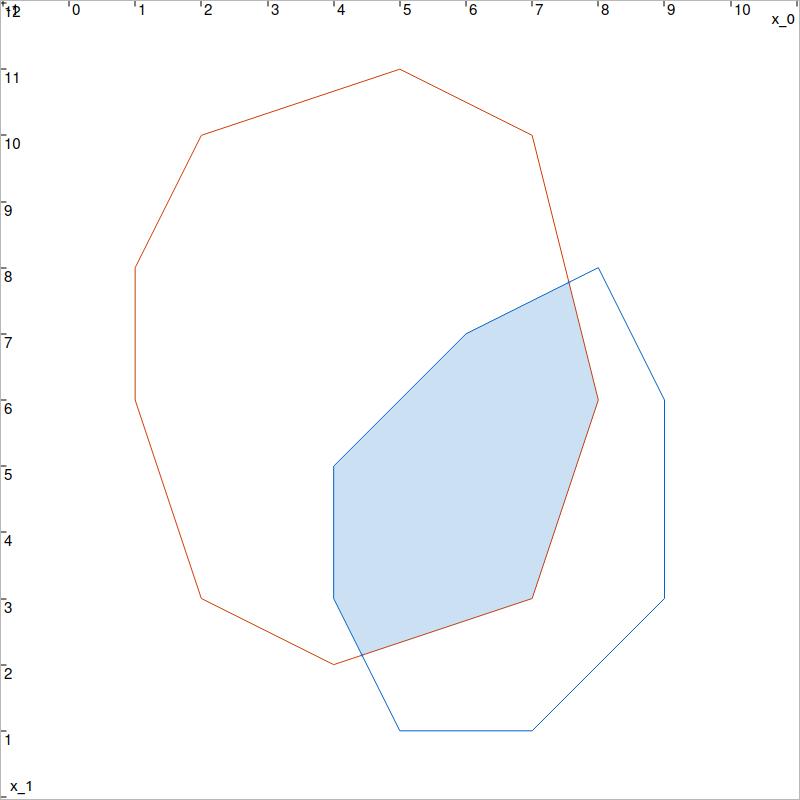

.. _sec-geom-polygon:

Polygon and ConvexPolygon
=========================

  Main author: `Simon Rohou <https://www.simon-rohou.fr/research/>`_

The following classes provide a reliable representation of polygons and convex polygons.

Polygon class
-------------

.. doxygenclass:: codac2::Polygon
  :project: codac
  :members:

ConvexPolygon class
-------------------

.. doxygenclass:: codac2::ConvexPolygon
  :project: codac
  :members:

.. doxygenfunction:: codac2::operator&(const ConvexPolygon&,const ConvexPolygon&)
  :project: codac

.. tabs::

  .. group-tab:: Python

    .. literalinclude:: src.py
      :language: py
      :start-after: [polygon-1-beg]
      :end-before: [polygon-1-end]
      :dedent: 4

  .. group-tab:: C++

    .. literalinclude:: src.cpp
      :language: c++
      :start-after: [polygon-1-beg]
      :end-before: [polygon-1-end]
      :dedent: 4

  Intersection of two convex polygons.