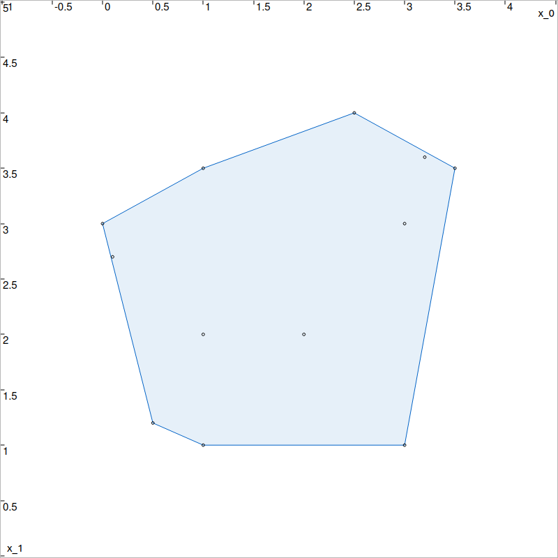

.. _sec-geom-utils:

Geometric utilities
===================

  Main author: `Simon Rohou <https://www.simon-rohou.fr/research/>`_

Alignment and orientation
-------------------------

The following functions provide reliable outputs for alignement evaluations.

.. doxygenfunction:: codac2::aligned(const IntervalVector&,const IntervalVector&,const IntervalVector&)
  :project: codac

.. tabs::

  .. group-tab:: Python

    .. literalinclude:: src.py
      :language: py
      :start-after: [geometry-2-beg]
      :end-before: [geometry-2-end]
      :dedent: 4

  .. group-tab:: C++

    .. literalinclude:: src.cpp
      :language: c++
      :start-after: [geometry-2-beg]
      :end-before: [geometry-2-end]
      :dedent: 4

.. doxygenfunction:: codac2::orientation(const IntervalVector&,const IntervalVector&,const IntervalVector&)
  :project: codac

.. tabs::

  .. group-tab:: Python

    .. literalinclude:: src.py
      :language: py
      :start-after: [geometry-1-beg]
      :end-before: [geometry-1-end]
      :dedent: 4

  .. group-tab:: C++

    .. literalinclude:: src.cpp
      :language: c++
      :start-after: [geometry-1-beg]
      :end-before: [geometry-1-end]
      :dedent: 4

Convex hull
-----------

.. doxygenfunction:: codac2::convex_hull(std::vector<IntervalVector>)
  :project: codac

.. tabs::

  .. group-tab:: Python

    .. literalinclude:: src.py
      :language: py
      :start-after: [geometry-3-beg]
      :end-before: [geometry-3-end]
      :dedent: 4

  .. group-tab:: C++

    .. literalinclude:: src.cpp
      :language: c++
      :start-after: [geometry-3-beg]
      :end-before: [geometry-3-end]
      :dedent: 4

  Convex hull of a set of points.