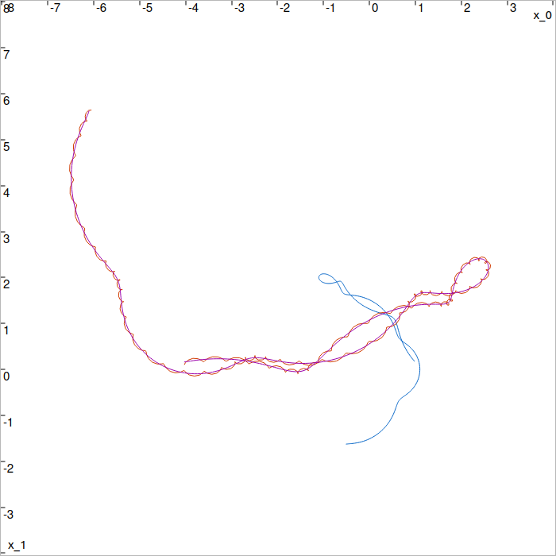

.. _sec-tools-registration:

Affine transformation estimation
================================

The ``affine_transformation()`` functions allow to compute the affine transformation (translation, rotation, scaling) that best aligns an ordered set of 2d points ``src`` with another set ``dst``. This transformation is obtained using Singular Value Decomposition (SVD).
Please note that these functions do not employ any guaranteed calculation, and the result is only an approximation that can be used for certain applications such as robotics.

The output is an ``Affine2d`` object from the `Eigen library <https://eigen.tuxfamily.org/>`_, fully available in C++. However, the Python binding of this class is only partial.

Constraints and Limitations
---------------------------

- **Number of points**: the vectors ``src`` and ``dst`` must contain the same number of points (at least 2 points are required to determine a unique transformation).
- **Optimal alignment**: the transformation is computed using a least-squares criterion, meaning it minimizes the mean squared error between the transformed points of ``src`` and those of ``dst``.
- **Noise sensitivity**: in the presence of noise in the data, results may be affected, and pre-processing may be necessary.
- **No projective transformations**: this function cannot estimate projective or homographic transformations; it is limited to affine transformations.

Usage
-----

Inputs ``src`` and ``dst`` can be provided either as a list of 2d points, or with sampled trajectories. The ordering of the points in these lists matters: every i-th point in the first list must correspond to the i-th point in the other.

.. tabs::
  
  .. code-tab:: py

    def affine_transformation(src, dst):
    # with src/dst: two lists of Vector objects, or two SampledVectorTraj objects

  .. code-tab:: c++

    Eigen::Affine2d affine_transformation(const std::vector<Vector>& src, const std::vector<Vector>& dst);
    Eigen::Affine2d affine_transformation(const SampledTraj<Vector>& src, const SampledTraj<Vector>& dst);

The following example estimates a transformation between two sampled trajectories.

.. tabs::
  
  .. code-tab:: py

    # Building the src trajectory analytically

    t = ScalarVar()
    f_src = AnalyticFunction([t], [
      cos(2*t)+0.1*cos(10*t),
      2*sin(t)+0.1*sin(10*t)
    ])

    src = AnalyticTraj(f_src,[-1,3]).sampled(0.01)

    # The dst trajectory is obtained analytically with a
    # transformation described by the parameters:

    a = PI + PI/3 # rotation angle
    b = 2.5 # scaling
    T = Vector([ -3.2, 2.5 ]) # translation
    f_dst = AnalyticFunction([t], [
      b*cos(a)*f_src(t)[0]-b*sin(a)*f_src(t)[1] + T[0] + 0.05*cos(100*t),
      b*sin(a)*f_src(t)[0]+b*cos(a)*f_src(t)[1] + T[1] + 0.05*sin(100*t)
    ])

    dst = AnalyticTraj(f_dst,[-1,3]).sampled(0.01)

    # Computing the transformation

    tr = affine_transformation(src, dst)

    # Reconstructing the dst trajectory using the estimated transformation

    dst_estim = SampledVectorTraj()
    for ti,src_i in src:
      dst_estim.set(ti, tr*src_i)

  .. code-tab:: c++

    // Building the src trajectory analytically

      ScalarVar t;
      AnalyticFunction f_src({t}, {
        cos(2*t)+0.1*cos(10*t),
        2*sin(t)+0.1*sin(10*t)
      });

      SampledTraj<Vector> src = AnalyticTraj(f_src,{-1,3}).sampled(0.01);

    // The dst trajectory is obtained analytically with a
    // transformation described by the parameters:
    
      double a = PI + PI/3; // rotation angle
      double b = 2.5; // scaling
      Vector T({ -3.2, 2.5 }); // translation

      AnalyticFunction f_dst({t}, {
        b*cos(a)*f_src(t)[0]-b*sin(a)*f_src(t)[1] + T[0] + 0.05*cos(100*t),
        b*sin(a)*f_src(t)[0]+b*cos(a)*f_src(t)[1] + T[1] + 0.05*sin(100*t)
      });

      SampledTraj<Vector> dst = AnalyticTraj(f_dst,{-1,3}).sampled(0.01);

    // Computing the transformation

      Eigen::Affine2d tr = affine_transformation(src, dst);

    // Reconstructing the dst trajectory using the estimated transformation

      SampledTraj<Vector> dst_estim;
      for(const auto& [ti,src_i] : src)
        dst_estim.set(ti, tr*Eigen::Vector2d(src_i));

  Plot of the ``src`` (blue), noised ``dst`` (red) and estimated ``dst_estim`` (purple) trajectories. ``dst_estim`` fits the initial ``dst`` trajectory.

Note that transformation values can be obtained from the ``Affine2d`` object using:

.. tabs::
  
  .. code-tab:: py

    s = tr.linear().col(0).norm()   # scaling value
    R = tr.linear() / s             # rotation matrix
    angle = atan2(R(1,0), R(0,0))
    T = tr.translation()            # translation vector

  .. code-tab:: c++

    double s = tr.linear().col(0).norm(); // scaling value
    Matrix R = tr.linear() / s;           // rotation matrix
    double angle = atan2(R(1,0), R(0,0));
    Vector T = tr.translation();          // translation vector

See Also
--------
- `Eigen::JacobiSVD <https://eigen.tuxfamily.org/dox/classEigen_1_1JacobiSVD.html>`_ for more details on the SVD decomposition used.
- `Space transformations <https://eigen.tuxfamily.org/dox/group__TutorialGeometry.html>`_ to understand affine transformation representation in Eigen.