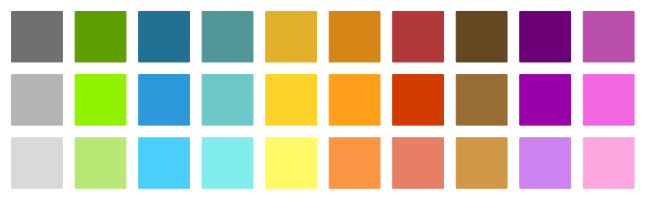

.. _sec-graphics-colors:

Styles, colors and color maps
=============================

  Main author: `Maël Godard <https://godardma.github.io>`_

Colors
------

Predefined colors are available in the ``Color`` class. Each of the static methods can take an argument to define the transparency of the color between 0 (full transparency) and 1 (full opacity).

.. tabs::

  .. code-tab:: py

    Color.none(), Color.white(), Color.black()
    Color.light_gray(), Color.gray(), Color.dark_gray()
    Color.light_green(), Color.green(), Color.dark_green()
    Color.light_blue(), Color.blue(), Color.dark_blue()
    Color.light_cyan(), Color.cyan(), Color.dark_cyan()
    Color.light_yellow(), Color.yellow(), Color.dark_yellow()
    Color.light_orange(), Color.orange(), Color.dark_orange()
    Color.light_red(), Color.red(), Color.dark_red()
    Color.light_brown(), Color.brown(), Color.dark_brown()
    Color.light_purple(), Color.purple(), Color.dark_purple()
    Color.light_pink(), Color.pink(), Color.dark_pink()

  .. code-tab:: c++

    Color::none(), Color::white(), Color::black()
    Color::light_gray(), Color::gray(), Color::dark_gray()
    Color::light_green(), Color::green(), Color::dark_green()
    Color::light_blue(), Color::blue(), Color::dark_blue()
    Color::light_cyan(), Color::cyan(), Color::dark_cyan()
    Color::light_yellow(), Color::yellow(), Color::dark_yellow()
    Color::light_orange(), Color::orange(), Color::dark_orange()
    Color::light_red(), Color::red(), Color::dark_red()
    Color::light_brown(), Color::brown(), Color::dark_brown()
    Color::light_purple(), Color::purple(), Color::dark_purple()
    Color::light_pink(), Color::pink(), Color::dark_pink()

Each basic color is available in three shades: ``light_``, normal and ``dark_``:

Custom colors can be defined in the RGB or HSV color spaces. An enumeration ``Model`` is used to make the distinction between the two.

.. tabs::

  .. code-tab:: py
      
    Model.RGB # RGB color space
    Model.HSV # HSV color space

  .. code-tab:: c++

    Model::RGB; // RGB color space
    Model::HSV; // HSV color space

A getter ``model()`` is available, and the methods ``rgb()`` and ``hsv()`` are used to do the conversion between the two color spaces.

If the color is in RGB then the red, green, blue and alpha values are between 0 and 255.
If the color is in HSV then the hue value is between 0 and 360 while the saturation, value and alpha values are between 0 and 100.

The ``Color`` class constructor can take different arguments:

- no argument : black color
- an array of 3 floats and a ``Model`` (default is RGB): the RGB or HSV values
- an array of 4 floats and a ``Model`` (default is RGB): the RGBA or HSVA values and the transparency
- a list of 3 or 4 floats and a ``Model`` (default is RGB): the RGB, HSV, RGBA or HSVA values
- a string : the HTML representation of the color (e.g. "#FF0000" for red)

Additionnal methods are available for any useful purpose:

- ``hex_str()`` : the html representation of the color
- ``vec()`` : the RGBA or HSVA values in a vector

``Color`` creation example :

.. tabs::

  .. code-tab:: py

    # Predefined colors without and with opacity
    fig.draw_point([2,2], [Color.red(),Color.yellow(0.5)])
    # HTML color without and with opacity
    fig.draw_box([[2.4,2.9],[2.4,2.9]], [Color("#da3907"),Color("#da390755")])
    # HSV color without and with opacity
    fig.draw_box([[2.6,3.1],[2.6,3.1]], [Color([108,90,78],Model.HSV),Color([108,90,78,20],Model.HSV)])

  .. code-tab:: c++

    // Predefined colors without and with opacity
    fig.draw_point({2,2}, {Color::red(),Color::yellow(0.5)});
    // HTML color without and with opacity
    fig2.draw_box({{2.4,2.9}, {2.4,2.9}}, {Color("#da3907"),Color("#da390755")});
    // HSV color without and with opacity
    fig2.draw_box({{2.6,3.1},{2.6,3.1}}, {Color({108,90,78},Model::HSV),Color({108,90,78,20},Model::HSV)});

StyleProperties
---------------

By default, the drawn shapes will have a black edge and no fill. A ``StyleProperties`` object can be passed as an additionnal argument to change it.

Predefined styles are available in the ``StyleProperties`` class:

- ``inside()`` : dark-gray edge, green fill
- ``outside()`` : dark-gray edge, light blue fill
- ``boundary()`` : dark-gray edge, yellow fill

A ``StyleProperties`` object is composed of two ``Color`` objects, one for the edge and one for the fill. Three constructors are available:

.. tabs::

  .. code-tab:: py

    default_style = StyleProperties() # default
    edge_style = StyleProperties(Color.red()) # edge only
    edge_fill_style = StyleProperties([Color.blue(),Color.green()]) # edge and fill

  .. code-tab:: c++

    StyleProperties default_style; // default
    StyleProperties edge_style(Color::red()); // edge only
    StyleProperties edge_fill_style({Color::blue(),Color::green()}); // edge and fill

It can also be deduced from one or two ``Color`` objects.

.. tabs::

  .. code-tab:: py

    fig.draw_box([[2,5],[2,5]]) # Default style
    fig.draw_box([[2,5],[2,5]], StyleProperties.inside()) # dark-gray edge, green fill
    fig.draw_box([[2,5],[2,5]], Color.red()) # red edge, no fill
    fig.draw_box([[2,5],[2,5]], [Color.blue(),Color.green()]) # blue edge, green fill

  .. code-tab:: c++

    fig.draw_box({{2,5},{2,5}}); // Default style
    fig.draw_box({{2,5},{2,5}}, StyleProperties::inside()); // dark-gray edge, green fill
    fig.draw_box({{2,5},{2,5}}, Color::red()); // red edge, no fill
    fig.draw_box({{2,5},{2,5}}, {Color::blue(),Color::green()}); // blue edge, green fill

In addition, optional arguments can be passed to the ``StyleProperties`` object to define line style, line width, layer and Z-value.
For more information, see :ref:`subsec-graphics-colors-optional-arguments`.

.. tabs::

  .. code-tab:: py
    
    fig.draw_box([[2,5],[2,5]], StyleProperties(Color.red(), "..", "layer1", "w:0.1", "z:1.5"))
    # Red edge, dotted line, line width of 0.1, z-value of 1.5 and on layer1

  .. code-tab:: c++

    fig.draw_box({{2,5},{2,5}}, StyleProperties(Color::red(), "..", "layer1", "w:0.1", "z:1.5"));
    // Red edge, dotted line, line width of 0.1, z-value of 1.5 and on layer1

Color maps
----------

Color maps are used to convert a scalar value (between 0 and 1) to a color. The ``ColorMap`` class provides a set of predefined color maps:

.. tabs::

  .. code-tab:: py

    ColorMap.basic() # default color map
    ColorMap.haxby() # Haxby color map
    ColorMap.rainbow() # rainbow color map
    ColorMap.blue_tube() # blue color map, used mainly for tubes
    ColorMap.red_tube() # red color map, used mainly for tubes

  .. code-tab:: c++

    ColorMap::basic(); // default color map
    ColorMap::haxby(); // Haxby color map
    ColorMap::rainbow(); // rainbow color map
    ColorMap::blue_tube(); // blue color map, used mainly for tubes
    ColorMap::red_tube(); // red color map, used mainly for tubes

These five color maps are displayed below:

.. figure:: img/colormaps.png
  :width: 400px

A paramater ``alpha`` can be passed to the predefined color maps to set the opacity of the colors (between 0 and 1). The default value is 1 (full opacity).

.. tabs::

  .. code-tab:: py

    # Create a haxby color map with 50% opacity
    cmap = ColorMap.haxby(0.5)

  .. code-tab:: c++

    // Create a haxby color map with 50% opacity
    ColorMap cmap = ColorMap::haxby(0.5);

The method ``color()`` is used to get the color corresponding to a scalar value. The argument is a float between 0 and 1.

As for the ``Color`` class, the ``ColorMap`` also has a ``Model`` (RGB or HSV) and an associated getter ``model()``. The default ``Model`` is RGB.

You can also create your own color map :

.. tabs::

  .. code-tab:: py

    # Create a custom color map
    custom_map = ColorMap(Model.RGB)
    custom_map[0] = Color([255,0,0])
    custom_map[0.5] = Color([0,255,0])
    custom_map[1] = Color([0,0,255])

  .. code-tab:: c++

    // Create a custom color map
    ColorMap custom_map(Model::RGB);
    custom_map[0] = Color({255,0,0});
    custom_map[0.5] = Color({0,255,0});
    custom_map[1] = Color({0,0,255});

Note that you can add RGB and HSV colors to the same color map. The model of the color map will define the interpolation space.

StyleGradientProperties
-----------------------

Some shapes can be drawn with a color map (trajectories, tubes, ...). By default, the drawn shapes will use the basic color map. 
A ``StyleGradientProperties`` object can be passed as an additionnal argument to change it.

A ``StyleGradientProperties`` object involves a ``ColorMap``. Two constructors are available:

.. tabs::

  .. code-tab:: py

    default_style = StyleGradientProperties() # default
    custom_style = StyleGradientProperties(ColorMap.haxby()) # haxby color map

  .. code-tab:: c++

    StyleGradientProperties default_style; // default
    StyleGradientProperties custom_style(ColorMap::haxby()); // haxby color map

It can also be deduced from a ``ColorMap`` object.

.. tabs::

  .. code-tab:: py

    fig.draw_trajectory(traj) # Default style
    fig.draw_trajectory(traj,ColorMap.haxby()) # haxby color map

  .. code-tab:: c++

    fig.draw_trajectory(traj); // Default style
    fig.draw_trajectory(traj,ColorMap::haxby()); // haxby color map

In addition, optional arguments can be passed to the ``StyleProperties`` object to define line style, line width, layer and Z-value.
For more information, see :ref:`subsec-graphics-colors-optional-arguments`.

.. tabs::

  .. code-tab:: py
    
    fig.draw_trajectory(traj, StyleGradientProperties(ColorMap.haxby(), "..", "layer1", "w:0.1", "z:1.5"))
    # haxby color map, dotted line, line width of 0.1, z-value of 1.5 and on layer1

  .. code-tab:: c++

    fig.draw_trajectory(traj, StyleGradientProperties(ColorMap::haxby(), "..", "layer1", "w:0.1", "z:1.5"));
    // haxby color map, dotted line, line width of 0.1, z-value of 1.5 and on layer1

.. _subsec-graphics-colors-optional-arguments:

Optional arguments
------------------

For every constructor of ``StyleProperties`` and ``StyleGradientProperties``, optional arguments can be passed to define a line style, a line width, a layer and/or a Z-value.
Note that these four arguments are optional, only the desired ones can be added and they can be added in any order.

Line style
~~~~~~~~~~

A string can be passed to define the line style (default is solid).

Available line styles are:
  - ``"-"`` (solid)
  - ``"--"`` (dashed)
  - ``".."`` (dotted)
  - ``"-."`` (dash-dotted)
  - ``"-.."`` (dash-dot-dotted)

Line width
~~~~~~~~~~

A string starting with ``"w:"`` followed by a float can be passed to define the line width (default is 0)

Z-value
~~~~~~~~

**Warning: the Z-value has been added to VIBes since PR #150, a release is being prepared**

A string starting with ``"z:"`` followed by a float can be passed to define the Z-value (default is 0)

This Z-value represents the height of an object : the higher the Z-value, the higher the object will be.
An object with a Z-value of 0.5 will be drawn on top of an object with a Z-value of 0, but behin an object of Z-value 1.

**Notes**

Some objects have a non-null default Z-value.

- Tubes are by default drawn at ``z=-1``
- On pavings (and in the corresponding predefined styles)
    - Outside boxes are drawn at ``z=-3``
    - Boundary boxes are drawn at ``z=-2``
    - Inside boxes are drawn at ``z=-1``

Layer
~~~~~

A string can be passed to define the layer to draw on (default is "alpha"). 
Note that this case is the last as it is the "fallback" case : 
if the string is not a line style and does not start with ``"w:"`` or ``"z:"``, it is a layer name.

Note that these layers are only used in IPE (see :ref:`sec-graphics-ipe`). Only the layers for paving are converted as VIBes groups.

**Notes**

On pavings and in the corresponding predefined styles

- Outside boxes are drawn on layer ``outside``
- Boundary boxes are drawn on layer ``boundary``
- Inside boxes are drawn on layer ``inside``